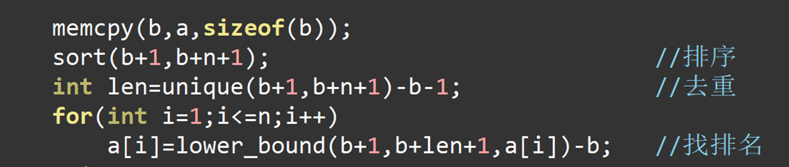
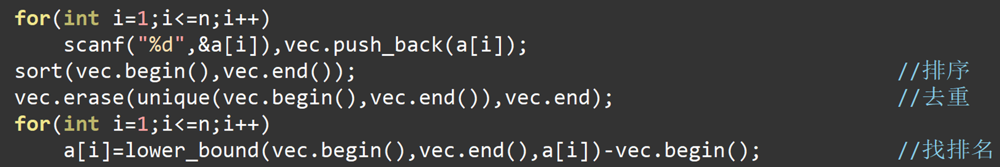
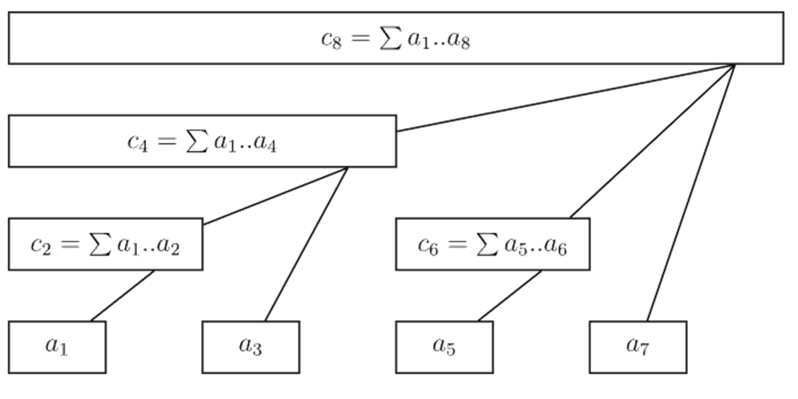

```c++
i>>j&1 //判断i的第j位是否为1、取出i的第j位
i&1 //判断i的最后一位是否为1
gcd(x,y,z)=gcd(x,y-x,z-y)
```

> 异或是不进位的加法

素数：1e9+7，998244353，99991

### 关闭流同步

```c++
ios::sync_with_stdio(false), cin.tie(0);
```

### 快读

```c++
int read() {
	int sum=0,p=1;
	char c=getchar();
	while(c<'0'||c>'9') {
		if(c=='-') p=-1;
		c=getchar();
	}
	while(c>='0'&&c<='9') {
		sum=(sum*10+c-'0')%mod;
		c=getchar();
	}
	return sum*p;
}
```
### __int128快读
```c++
__int128 read()
{
	//直接在函数里面实现读字符串操作更简洁
	__int128 res=0;//初始结果赋值0
	char scan[1005];
	scanf("%s",scan);
	for(int i=0;i<strlen(scan);i++)
		res*=10,res+=scan[i]-'0';//实现进位
	return res;//返回__int128类型
}

void print(__int128 num)
{//递归调用，实现从高位向低位输出
	if(num>9) 
		print(num/10);
	putchar(num%10+'0');
}
```

# 二分

### 整数 

```c++
int l = 1, r = n, mid;
while (l <= r){
    mid = (l + r) / 2;
    if (check(mid)) l = mid;
    else r = mid - 1;
}
int ans = l;
```

```c++
int l = 1, r = n, mid;
while (l <= r){
    mid = (l + r + 1) / 2;
    if (check(mid)) l = mid + 1;
    else r = mid;
}
int ans = l;
```


### 小数

```c++
double l = a, r = b, mid, eps = 1e-6;
while (r - l >= eps){
    mid = l + (r - l) / 2.;
    if (f(mid) >= -eps)r = mid;
    else l = mid;
}
cout << l;
```

# 三分

```c++
double l, r, lsec, rsec, eps = 1e-8, mid;
while (r - l >= eps){
    mid = (l + r) / 2;
    lsec = mid - eps;
    rsec = mid + eps;
    if (f(lsec) < f(rsec)) l = mid;
    else r = mid;
}
printf("%.5lf\n", l);
```

# 整除分块

```c++
for(int l=a,r=a;l<=b;l=r+1)
{
    r=b/(b/l);
    int k=b/l;
}

 for(int l=a,r=a;l<=b;l=r)
 {
     r=b/(b/l);
     r+=(r==l);
     int k=b/l;
 }
```

# 离散化





# STL

### **重载运算符**

```c++
bool operator<(const Point& a) const{ return x < a.x; }//重载小于号 
friend bool operator>(Point a, Point b){ return a.x > b.x; }//重载大于号 
```

### **priority_queue**

大顶堆定义小于号，小顶堆定义大于号，greater

```c++
struct Point{
	int x, y;
	friend bool operator<(Point a, Point b){return a.x < b.x;}
};
priority_queue<Point> a; //大顶堆

struct Point {
	int x, y;
	friend bool operator>(Point a, Point b){return a.x > b.x;}
}; 
priority_queue<Point, vector<Point>, greater<Point> > a; //小顶堆
```

# 数据结构

### ST表

RMQ：区间最大/最小值

ST表可解决RMQ，区间gcd等问题， $O(nlogn) $预处理， $O(1) $询问

令 $f(i,j) $表示区间 $[i,i+2^j-1] $的最大值。显然 $f(i,0)=a_i $。

状态转移方程： $f(i,j)=\max(f(i,j-1),f(i+2^{j-1},j-1)) $。

对于每个询问 $[l,r] $，我们把它分成两部分： $f[l,s] $与 $f[r-2^s+1,s] $，其中 $s=\left\lfloor\log_2(r-l+1)\right\rfloor $。两部分的结果的最大值就是回答。

log 函数预处理：

$$
\left\{\begin{aligned}
Logn[1] &=0, \\
Logn\left[i\right] &=Logn[\frac{i}{2}] + 1.
\end{aligned}\right.
$$

### 并查集

```c++
int find(int x){
	if (fa[x]==x) return x;
	else return fa[x]=find(fa[x]);
} 
void Union(int x,int y){
	int fx=find(x),fy=find(y);
	if (fx==fy)return;
	fa[fx]=fy;
}
for (int i=1;i<=n;i++) fa[i]=i;
```

### 线段树

区间修改，区间查询

```c++
#include<bits/stdc++.h>
using namespace std;
#define mid ((l+r)>>1)
#define lson rt<<1,l,mid
#define rson rt<<1|1,mid+1,r
#define N 10010

typedef long long ll;
const int MOD = 1e9 + 7;
int sum[N * 4], lazy[N * 4], a[N];

void pushup(int rt) { sum[rt] = sum[rt << 1] + sum[rt << 1 | 1]; }

void pushdown(int rt, int l, int r) {
    if (!lazy[rt]) return;
    lazy[rt << 1] += lazy[rt];
    sum[rt << 1] += lazy[rt] * (mid - l + 1);

    lazy[rt << 1 | 1] += lazy[rt];
    sum[rt << 1 | 1] += lazy[rt] * (r - mid);

    lazy[rt] = 0;
}

void build(int rt, int l, int  r) {
    if (l == r) {
        sum[rt] = a[l];
        return;
    }
    build(lson);
    build(rson);
    pushup(rt);
}

int query(int rt, int l, int r, int L, int R) {//询问L到R区间和
    if (l == L && r == R)
        return sum[rt] ;
    pushdown(rt, l, r);
    if (mid < L)
        return query(rson, L, R) ;
    else if (mid >= R)
        return query(lson, L, R) ;
    else
        return query(lson, L, mid) + query(rson, mid + 1, R);
}

void update(int rt, int l, int r, int L, int R, int val) {//L到R每个数都加val
    if (l == L && r == R) {
        sum[rt] += val * (r - l + 1);
        lazy[rt] += val;
        return;
    }
    pushdown(rt, l, r);
    if (mid < L)
        update(rson, L, R, val);
    else if (mid >= R)
        update(lson, L, R, val);
    else {
        update(lson, L, mid, val);
        update(rson, mid + 1, R, val);
    }
    pushup(rt);
}

int main() {
    ios::sync_with_stdio(false), cin.tie(0);
    int m, n;
    cin >> n >> m;
    for (int i = 1; i <= n; i++)
        cin >> a[i];
    build(1, 1, n);

    while (m--) {
        int op, x, y;
        cin >> op >> x >> y;
        if (op == 1) {
            int k;
            cin >> k;
            update(1, 1, n, x, y, k);
        }
        else if (op == 2)
            cout << query(1, 1, n, x, y);
    }
    return 0;
}
```

### 树状数组

单点修改，区间查询

普通树状数组维护的信息及运算要满足 **结合律** 且 **可差分**

```c++
int n,t[200010];
int lowbit(int x){return x&(-x);}
int find(int x){//区间查询
	int sum = 0;
	for (; x ; x -= lowbit(x)) sum += t[x];
    return sum;
}
void add(int x, int k){//将[x,n]区间内每个数都加k，单点修改
	for (; x <= n; x += lowbit(x)) t[x] += k;
}
//建树：n次单点修改,o(nlogn)
```



# 动态规划

### 高位前缀和/sos dp

求满足a^b=a+b的数对个数

```c++
for (int i = 1; i <= n; i++) {
    cin >> a[i];
    sum[a[i]]++;
}
int mx = (1 << 17) - 1;
for (int j = 0; j < 17; j++) {//枚举当前处理哪一维度
    for (int i = 0; i <= mx; i++) {
        if (i & (1 << j)) {
            sum[i] += sum[i ^ (1 << j)];//如果该维度为1，统计上该维度为0的前缀和
        }
    }
}
for (int i = 1; i <= n; i++) {
    ans += sum[a[i] ^ mx];
}
cout << ans << "\n";
```

### 01背包

有 N件物品和一个容量为 M 的背包。第 i件物品的重量是Wi，价值是 Di。求解将哪些物品装入背包可使这些物品的重量总和不超过背包容量，且价值总和最大。

```c++
for (int i=1;i<=n;i++){
    for (int j=m;j>=w[i];j--){
        dp[j]=max(dp[j],dp[j-w[i]]+d[i]);
    }
} 
```

### 完全背包

```c++
for (int i=1;i<=n;i++){
    for (int j=w[i];j<=m;j++){
        dp[j]=max(dp[j],dp[j-w[i]]+d[i]);
    }
} 
```

### 树形dp

##### 没有上司的舞会

f[x][0]表示以x为根的子树，且x不参加舞会的最大快乐值

f[x][1]表示以x为根的子树，且x参加了舞会的最大快乐值

```c++
#include<bits/stdc++.h>
#include <iostream>
#include <algorithm>
#include<vector>
using namespace std;
int n, r[6003], l, k, dp[6003][2];
vector<int>point[6003];
int dfs(int rt, int state) {//以rt为根的子树，选择/不选rt获得的最大快乐值
    if (dp[rt][state] != -1) return dp[rt][state];
    int ans = 0;
    if (state == 1) {
        for (auto it : point[rt])
            ans += dfs(it, 0);
        return dp[rt][state] = ans + r[rt];
    }
    else {
        for (auto it : point[rt])
            ans += max(dfs(it, 0), dfs(it, 1));
        return dp[rt][state] = ans;
    }
}
int main() {
    cin >> n;
    for (int i = 1; i <= n; i++) {
        cin >> r[i];
    }
    for (int i = 1; i < n; i++) {
        cin >> l >> k;
        point[k].push_back(l);
    }
    memset(dp, -1, sizeof(dp));
    int res = 0;
    for (int i = 1; i <= n; i++) {
        res =max(res, max(dfs(i, 1), dfs(i, 0)));
    }
    cout << res << "\n";
}
```

### 树上背包

树上背包=树形dp+背包问题

##### 选课

设f(u,i,j)表示以u号点为根的子树中，已经遍历了u号点的前i棵子树，选了j门课程的最大学分。

```c++
//#include<bits/stdc++.h>
#include <iostream>
#include <algorithm>
#include<vector>
using namespace std;
int n, m, s[305], k, dp[305][305], visit[305];
vector<int>lesson[6003];
void dfs(int rt) {
    if (visit[rt]) return;
    visit[rt] = 1;
    dp[rt][1] = s[rt];//初始化
    for (auto it : lesson[rt]) {
        dfs(it);
        for (int i = m + 1; i >= 0; i--) {//倒序，保证dp[rt][i-j]中选取的结点只包含it子树前面子树的结点。（参考01背包）
            for (int j = 0; j < i; j++) {//j<i,因为i-j!=0，保证rt结点一定被选上
                dp[rt][i] = max(dp[rt][i], dp[it][j] + dp[rt][i - j]);
            }
        }
    }
}
int main() {
    cin >> n >> m;
    for (int i = 1; i <= n; i++) {
        cin >> k >> s[i];
        lesson[k].push_back(i);
    }
    dfs(0);
    cout << dp[0][m + 1] << "\n";//以0为根，要选m+1个点，所得到的最大学分
}
```

### 悬线法求最大子矩阵

```c++
//动态规划求最优子矩阵用悬线法，悬线法就是从左边上边推到这个点的状态，然后更新这个点的状态然后处理。
//代码是求最大01相间矩阵的
#include<bits/stdc++.h>
using namespace std;  
const int maxn=2010;
int ma[maxn][maxn];
int l[maxn][maxn],r[maxn][maxn],up[maxn][maxn];
int main(){
    int n,m;
    cin>>n>>m;
    for(int i=1;i<=n;i++){
        for(int j=1;j<=m;j++){
            int tmp;
            cin>>tmp;
            ma[i][j]=tmp;
        }
    }
    for(int i=1;i<=n;i++){
        for(int j=1;j<=m;j++){
            l[i][j]=j;
            r[i][j]=j;
            up[i][j]=1;
        }
    }
    //先处理每一行的最长长度，然后处理每一列的，也可以先处理每一列的。
    for(int i=1;i<=n;i++){
        for(int j=2;j<=m;j++){
            if(ma[i][j]!=ma[i][j-1]){
                l[i][j]=l[i][j-1];
            }
        }
        for(int j=m-1;j>=1;j--){
            if(ma[i][j]!=ma[i][j+1]){
                r[i][j]=r[i][j+1];
            }
        }
    }
    int ans1=0,ans2=0;
    //每一行的最长长度已经算了出来，然后处理每一列的。
    //处理过程中
    for(int i=1;i<=n;i++){
        for(int j=1;j<=m;j++){
            if(i==1) continue;
            if(ma[i][j]!=ma[i-1][j]){    //核心部分
                up[i][j]=up[i-1][j]+1;
                l[i][j]=max(l[i-1][j],l[i][j]);
                r[i][j]=min(r[i][j],r[i-1][j]);
            }
            int len=r[i][j]-l[i][j]+1;
            ans1=max(ans1,min(up[i][j],len));
            ans2=max(ans2,up[i][j]*len);
            cout<<i<<" "<<j<<" "<<len<<endl;
            cout<<ans2<<endl;
        }
    }
    cout<<ans1*ans1<<endl;//最大正方形面积
    cout<<ans2<<endl;//最大矩形面积
    return 0;
}
```

### 归并排序（求逆序对）

求逆序对的常用方法还有树状数组

1. 逆序对个数也是冒泡排序需要的最少交换次数

2. 奇数码问题（8数码是n=3的奇数码）

```c++
void MergeSort(int l, int r) {
	//合并a[l,mid]和a[mid+1,r]
	//a是待排序数组，b是临时数组，cnt是逆序对个数
	if (l >= r)return;
	int mid = (l + r) >> 1;
	MergeSort(l, mid);
	MergeSort(mid + 1, r);
	int i = l, j = mid + 1;
	for (int k = l; k <= r; k++) {
		if (j > r || i <= mid && a[i] <= a[j])b[k] = a[i++];
		else {
			b[k] = a[j++];
			cnt += mid - i + 1;
		}
	}
	for (int k = l; k <= r; k++) a[k] = b[k];
}
```

# 图论

### 树上最近公共祖先（lca）

倍增法

首先选定某点为树根，dfs求每个点的深度depth，点 $x $的第 $2^i $级祖先 $f[x,i] $，点x到第 $2^i $级祖先的距离。之后lca函数求x到y的距离，

```c++
#include<bits/stdc++.h>
using namespace std;
#define int long long
struct edge{
	int u,v,w;
}e[50004];
struct ed{
	int v,w; 
};
vector<ed>graph[10004];
int fa[10004],f[10004][35],res[10004][35],dep[10004];
set<int>st;
int find(int x){
	if (fa[x]==x)return fa[x];
	else return fa[x]=find(fa[x]);
}
void Union(int x,int y){
	int fx=find(x),fy=find(y);
	if (fx==fy)return;
	else fa[fx]=fy;
}
bool cmp(edge a,edge b){
	return a.w>b.w;
}
void dfs(int now,int father){
	f[now][0]=father;
	dep[now]=dep[father]+1;
	for (int i=1;i<=30;i++){
		f[now][i]=f[f[now][i-1]][i-1];
		res[now][i]=min(res[f[now][i-1]][i-1],res[now][i-1]);
	}
	for (vector<ed>::iterator it=graph[now].begin();it!=graph[now].end();it++){
		int v=(*it).v,w=(*it).w;
		if (v==father)continue;
		f[v][0]=now;
		res[v][0]=w;
		dfs(v,now);
	}
}
int lca(int x,int y){
	if (dep[x]<dep[y])swap(x,y);
	int cha=dep[x]-dep[y];
	int i=0,ans=0x3f3f3f3f;
	while (cha){
		if (cha&1){
			ans=min(ans,res[x][i]);
			x=f[x][i];
		}
		cha>>=1;
		i++;
	}
	if (x==y)return ans;
	for (i=30;i>=0;i--){
		if (f[x][i]==f[y][i])continue;
		ans=min(ans,min(res[x][i],res[y][i]));
		x=f[x][i];
		y=f[y][i];
	}
	ans=min(ans,min(res[x][0],res[y][0]));
	return ans;
}
signed main (){
	ios::sync_with_stdio(false),cin.tie(0);
//	freopen("P1396_4.in","r",stdin);
//	freopen("P1396_4.out","w",stdout);
	int n,m,x,y,z,q;
	cin>>n>>m;
	for (int i=1;i<=n;i++)fa[i]=i;
	for (int i=1;i<=m;i++){
		cin>>e[i].u>>e[i].v>>e[i].w;
	}
	sort(e+1,e+m+1,cmp);
	//最大生成树 
	for (int i=1;i<=m;i++){
		if (find(e[i].u)==find(e[i].v))continue;
		else{
			Union(e[i].u,e[i].v);
			graph[e[i].u].push_back({e[i].v,e[i].w});
			graph[e[i].v].push_back({e[i].u,e[i].w});
		}
	}
	//倍增法求lca 
	memset(res,0x3f,sizeof(res));
	for (int i=1;i<=n;i++){
		st.insert(find(i));
	}
	for (set<int>::iterator it=st.begin();it!=st.end();it++)dfs(*it,0);
	cin>>q;
	while (q--){
		cin>>x>>y;
		if (find(x)!=find(y))cout<<"-1\n";
		else cout<<lca(x,y)<<"\n";	
	}
}
```

tarjan算法


树链剖分

```c++
#include <bits/stdc++.h>
using namespace std;
const int maxn=500015;
struct edge{
	int v,fail;
}e[maxn*2];
int p[maxn],eid;
void init(){
	memset(p,-1,sizeof p);
	eid=0;
}
void insert(int u,int v){
	e[eid].v=v;
	e[eid].fail=p[u];
	p[u]=eid++;
}
int sz[maxn],dep[maxn],top[maxn],hson[maxn],fa[maxn];
void dfs1(int u){
	sz[u]=1;
	dep[u]=dep[fa[u]]+1;
	for(int i=p[u];~i;i=e[i].fail){
		int v=e[i].v;
		if(v!=fa[u]){
			fa[v]=u;
			dfs1(v);
			sz[u]+=sz[v];
			if(sz[v]>sz[hson[u]]){
				hson[u]=v;
			} 
		}
	} 
}
void dfs2(int u,int tp){
	top[u]=tp;
	if(hson[u]){
		dfs2(hson[u],tp);
	}
	for(int i=p[u];~i;i=e[i].fail){
		int v=e[i].v;
		if(v!=fa[u] && v!=hson[u]){
			dfs2(v,v);
		}
	}
}
int lca(int a,int b){
	while(top[a]!=top[b]){
		if(dep[top[a]]>dep[top[b]])swap(a,b);
		b=fa[top[b]];
	}
	return dep[a]>dep[b]?b:a;
}
int main(){
	init();
	int n,m,s;
	scanf("%d%d%d",&n,&m,&s); 
	for(int i=1;i<n;i++){
		int a,b;
		scanf("%d%d",&a,&b);
		insert(a,b);
		insert(b,a);
	} 
	dfs1(s);
	dfs2(s,s);
	for(int i=1;i<=m;i++){
		int a,b;
		scanf("%d%d",&a,&b);
		printf("%d\n",lca(a,b));
	}
	return 0;
}

```

### 强连通分量（tarjan算法）

我们可以将一张图的每个强连通分量都缩成一个点。然后这张图会变成一个 DAG，可以进行拓扑排序以及更多其他操作。

```c++
//时间复杂度o(n+m)
#define N 100005
vector<int> edge[N];
int stk[N],instk[N],top=0;//stk:栈数组；instk[i]:i是否在栈中；top:栈顶指针
int dfn[N],low[N],tot=0;//dfn:时间戳；low:追溯值；tot:当前访问的点的总数
int scc[N],siz[N],cnt=0;//scc[i]:点i在哪个强连通分量中；siz[i]:强连通分量i的大小；cnt:强连通分量的个数
int indeg[N];
void tarjan(int x){
    //入x时，盖戳，入栈
	dfn[x]=low[x]=++tot;
	stk[++top]=x;
	instk[x]=1;
	for (vector<int>::iterator it=edge[x].begin();it!=edge[x].end();it++){
		int y=*it;
		if (!dfn[y]){//若y未访问
			tarjan(y);
			low[x]=min(low[x],low[y]);//回x时更新low
		}else if (instk[y]){//若y已访问且在栈中
			low[x]=min(low[x],dfn[y]);//更新low
		}
	}
    //离x时更新scc
	if (dfn[x]==low[x]){//若x是scc的根
		int k;
		cnt++;
		do{
			k=stk[top--];
			instk[k]=0;
			scc[k]=cnt;//scc编号
			siz[cnt]++;//scc大小
		}while (x!=k);
	}
}
```

### 链式前向星

```c++
int eid,p[2*N];
struct edge{
	int v,fail;
}e[2*N];
void init(){
	memset(p,-1,sizeof(p));
	eid=0;
}
void add(int u,int v){
	e[eid].v=v;
	e[eid].nxt=p[u];
	p[u]=eid++;
}
for (int i=p[u];~i;i=e[i].fail){
	int v=e[i].v;
}
```

### Floyd

```c++
memset(dis,0x3f,sizeof(dis));
for (int i=1;i<=m;i++){
    cin>>u>>v>>w;
    dis[u][v]=w;
}
for (int k = 1; k <= n; k++) {	
    for (int i = 1; i <= n; i++) {
        for (int j = 1; j <= n; j++) {
            dis[i][j] = min(dis[i][j], dis[i][k] + dis[k][j]);
        }
    }
    // dis[k][i][j] = min(dis[k][i][j], dis[k-1][i][k] + dis[k-1][k][j]);
    // dis[k][i][j]表示除i和j外只经过结点1->k的情况下最短路的长度
    // 第0维可以省略
}
```

### Dijkstra

```c++
struct edge{
	int v,w;
};
struct path{
	int dis,u;
	bool operator>(const path& a)const{return dis>a.dis;}
};
vector<edge>graph[1005];
priority_queue<path,vector<path>,greater<path> >q;
int dis[1005],vis[1005];
void dij(int x){
	memset(dis,0x3f,sizeof(dis));
	memset(vis,0,sizeof(vis));
	dis[x]=0;
	q.push({0,x});
	while(!q.empty()){
		int u=q.top().u;
		q.pop();
		if (vis[u])continue;
		vis[u]=1;
		for (vector<edge>::iterator it=graph[u].begin();it!=graph[u].end();it++){
			int v=(*it).v,w=(*it).w;
			if (vis[v])continue;
			if (dis[v]>dis[u]+w){
				dis[v]=dis[u]+w;
				q.push({dis[v],v});
			}
		}
	}
}
```

### SPFA

```c++
queue<int>q;
void spfa(int s){
	memset(dis,0x3f,sizeof(int)*(n+1));
	q.push(s);
	dis[s]=0;
	vis[s]=1;
	while (!q.empty()){
		int u=q.front();
		q.pop();
		vis[u]=0;
		for (int i=head[u];i;i=nxt[i]){
			int v=to[i],w=val[i];
			if (dis[v]>dis[u]+w){
				dis[v]=dis[u]+w;
				if (!vis[v]){
					q.push(v);
					vis[v]=1;
				}
			}
		}
	}
}
```

### Kruskal 

```c++
const int maxn=100005;
int fa[maxn];
int head[maxn],to[maxn],nxt[maxn],val[maxn],tot=0;
struct edge{
	int u,v,w;
}e[maxn];
int find(int x){
	if (fa[x]==x)return x;
	else return fa[x]=find(fa[x]);
}
void Union(int x,int y){
	int fx=find(x),fy=find(y);
	if (fx==fy)reutrn;
	fa[fx]=fy;
}
bool cmp(edge a,edge b){
	return a.w<b.w;
}
void add(int u,int v,int w){
	nxt[++tot]=head[u];
	head[u]=tot;
	to[tot]=v;
	val[tot]=w;
}
int Kruskal(int s){
	for (int i=1;i<=n;i++)fa[i]=i;
	sort(e+1,e+1+m,cmp);
	int ans=0;
	for (int i=1;i<=m;i++){
		int u=e[i].u,v=e[i].v,w=e[i].w;
		if (find(u)==find(v))continue;
		Union(u,v);
		ans+=w;
		add(u,v,w);
		add(v,u,w); 
	}
	return ans;
```

### Prim

```c++
void prim(){
	memset(dis,0x3f,sizeof(int)*(n+1));
	dis[1]=0; // 以1为树根 
	for (int i=head[1];i;i=nxt[i]){ // 更新1能到达的点的最小距离
		int v=to[i],w=val[i];
		dis[v]=min(dis[v],w); // min可防止重边
	}
	int cnt=0,now=1;
	while (++cnt<=n-1){ // 只需循环n-1次,找n-1条边 
		int mn=0x3f3f3f3f;
		vis[now]=1;
		for (int i=1;i<=n;i++){ // 寻找离now最近的点
			if(!vis[i]&&mn>dis[i]){
				mn=dis[i];
				now=i;
			}
		}
		ans+=mn; // 最短的边加入答案
		for (int i=head[now];i;i=nxt[i]){ //用新的now更新距离
			int v=to[i],w=val[i];
			if (dis[v]>w&&!vis[v])dis[v]=w;
		}
	}
}
```

### 拓扑排序

```c++
int toposort() {
	int cnt = 0;
	for (int i = 1; i <= n; i++) {
		if (indegree[i] == 0) 
			q.push(i);	
	}
	while (!q.empty()) {
		int t = q.front();
		q.pop();
		cnt++;
		topo[cnt]=t;
		for (vector<int>::iterator it = graph[t].begin(); it != graph[t].end(); it++) {
			indegree[*it]--;
			if (indegree[*it] == 0)
				q.push(*it);
		}
	}
	if (cnt == n)
		return 1;
	else
		return 0;
}
```

### BFS

求经过的结点数最少的情况下的最短路径

```c++
#include<bits/stdc++.h>
using namespace std;
#define int long long
vector<pair<int, int> > graph[100005];
queue<int>q;
int vis[100005], cost[100005];
int n, m, u, v, w;
void bfs() {
    //bfs求经过结点数最少的路径
    //vis[i]表示1到i最少经过的结点数
    //cost[i]表示1到i经过的结点数最少的情况下的最短路径
	q.push(1);
	vis[1] = 1;
	while (!q.empty()) {
		int now = q.front();
		q.pop();
		for (auto it : graph[now]) {
			if (!vis[it.first]) {
				q.push(it.first);
				vis[it.first] = vis[now] + 1;
				cost[it.first] = cost[now] + it.second;
			}
			else if (vis[it.first] == vis[now] + 1) {
				cost[it.first] = min(cost[it.first], cost[now] + it.second);
			}
		}
	}
}
signed main() {
	ios::sync_with_stdio(false), cin.tie(0);
	cin >> n >> m;
	for (int i = 1; i <= m; i++) {
		cin >> u >> v >> w;
		graph[u].push_back(make_pair(v, w));
		graph[v].push_back(make_pair(u, w));
	}
	bfs();
	cout << vis[n] << " " << cost[n] << "\n";
}
```

### 二分图最大匹配

从前一个和谐的班级，有 $n_l $个是男生，有 $n_r $个是女生。编号分别为 $1, \dots, n_l $和 $1, \dots, n_r $。有若干个这样的条件：第 $v $个男生和第 $u $个女生愿意结为配偶。请问这个班级里最多产生多少对配偶？

```c++
#include<bits/stdc++.h>
using namespace std;
#define int long long
struct edge {
    int nxt,to;
}e[250005];
int cnt=1,head[505],vis[505],match[505],res[505];
void add(int u, int v) {//链式前向星存图
    e[cnt] = edge{ head[u],v };
    head[u] = cnt++;
}
int dfs(int u) {
    for (int i = head[u]; i; i = e[i].nxt) {
        int v = e[i].to;//女生
        if (vis[v]) continue;
        vis[v] = 1;
        if (match[v] == 0 || dfs(match[v])) {//女生未匹配或匹配的男生可以让出女生
            match[v] = u;
            return 1;
        }
    }
    return 0;
}
signed main() {
    ios::sync_with_stdio(false), cin.tie(0);
    int nl, nr, m, u, v;
    cin >> nl >> nr >> m;
    for (int i = 1; i <= m; i++) {
        cin >> u >> v;
        add(u, v);
    }
    int ans = 0;
    for (int i = 1; i <= nl; i++) {
        memset(vis, 0, sizeof(vis));//vis初始化为0
        if (dfs(i))ans++;
    }
    cout << ans << "\n";
}
```

# 树

### 树的直径

两次dfs：首先从任意节点 $y $开始进行第一次 DFS，到达距离其最远的节点，记为 $z $，然后再从 $z $开始做第二次 DFS，到达距离 $z $最远的节点，记为 $z' $，则 $\delta(z,z') $即为树的直径。

```c++
#include<bits/stdc++.h>
using namespace std;
#define int long long
vector<int> graph[200005];
int d[200005],c,pre[200005];
void dfs(int u,int fa){
	pre[u]=fa;
	for (vector<int>::iterator it=graph[u].begin();it!=graph[u].end();it++){
		int v=*it;
		if (v==fa)continue;
		d[v]=d[u]+1;
		if (d[v]>d[c])c=v;
		dfs(v,u);
	}
}
signed main(){
	ios::sync_with_stdio(false),cin.tie(0);
	int n,u,v;
	cin>>n;
	for (int i=1;i<=n-1;i++){
		cin>>u>>v;
		graph[u].push_back(v);
		graph[v].push_back(u);
	} 
	dfs(1,0);
	d[c]=0;
	dfs(c,0);
	cout<<d[c]<<"\n";
	int cnt=0;
	for (int i=c;cnt<=d[c];i=pre[i]){
		cnt++;
		cout<<i<<" ";
	}
}
```

### 霍夫曼树

```c++
#include<bits/stdc++.h>
using namespace std;
#define int long long
struct vex {
	double weight;
	int id;
	bool friend operator>(vex a, vex b) {
		return a.weight > b.weight;
	}
};

struct node {
	double weight;
	int id;
	node* lchild, * rchild;
}nod[300];
priority_queue<vex, vector<vex>, greater<vex> >q;
int ans[100], cnt = 0;
double cost = 0;
void dfs(int rt) {
	if (nod[rt].lchild == NULL && nod[rt].rchild == NULL) {
		cout << "第" << nod[rt].id << "个指令(使用频率为"<<nod[rt].weight<<")的编码为：";
		for (int i = 1; i <= cnt; i++)cout << ans[i];
		cout << "\n";
		cost += cnt * nod[rt].weight;
		return;
	}
	if (nod[rt].lchild != NULL) {
		ans[++cnt] = 0;
		dfs(nod[rt].lchild->id);
		cnt--;
	}
	if (nod[rt].rchild != NULL) {
		ans[++cnt] = 1;
		dfs(nod[rt].rchild->id);
		cnt--;
	}
}

signed main() {
	ios::sync_with_stdio(false), cin.tie(0);
	int tot = 78;
	for (int i = 1; i <= 10; i++) {
		q.push({ 0.049,i });
		nod[i].weight = 0.049;
		nod[i].id = i;
		nod[i].lchild = nod[i].rchild = NULL;
	}
	for (int i = 11; i <= 28; i++) {
		q.push({ 0.02,i });
		nod[i].weight = 0.02;
		nod[i].id = i;
		nod[i].lchild = nod[i].rchild = NULL;
	}
	for (int i = 29; i <= 78; i++) {
		q.push({ 0.003,i });
		nod[i].weight = 0.003;
		nod[i].id = i;
		nod[i].lchild = nod[i].rchild = NULL;
	}
	while (q.size() >= 2) {
		tot++;
		nod[tot].lchild = nod + q.top().id; q.pop();
		nod[tot].rchild = nod + q.top().id; q.pop();
		nod[tot].weight = nod[tot].lchild->weight + nod[tot].rchild->weight;
		nod[tot].id = tot;
		q.push({ nod[tot].weight,tot });
	}
	dfs(q.top().id);
	cout << "平均码长为：" << cost << "\n";
}
```

### Trie字典树

```c++
int trie[SIZE][26],tot=1,cnt[SIZE];//tot是trie树上节点个数
void insert(string str) {
	int len = str.length(), p = 1;
	for (int i = 0; i < len; i++) {
		int ch = str[i] - 'a';
		if (!trie[p][ch]) trie[p][ch] = ++tot;//结点中存储指针域
		p = trie[p][ch];//p指向子树
		cnt[p]++;//cnt表示满足的字符串个数
	}
}
int search(string str) {
	int len = str.length(), p = 1;
	for (int i = 0; i < len; i++) {
		int ch = str[i] - 'a';
		if (!trie[p][ch])return 0;
		p = trie[p][ch];
	}
	return cnt[p];
}
```

# 字符串

### 最小表示法
```c++
int n, i = 0, j = 1, k = 0, ans;
cin >> n;
for (int i = 0; i < n; i++)
cin >> a[i];
for (int i = n; i < 2 * n; i++)
a[i] = a[i - n];
while (i < n && j < n && k < n)
{
if (a[i + k] == a[j + k])
    k++;
else
{
    if (a[i + k] > a[j + k])
	i += k + 1;
    else
	j += k + 1;
    if (i == j)
	i++;
    k = 0;
}
}
ans = min(i, j);
for (i = 0; i < n; i++)
{
cout << a[ans + i] << " ";
}
```

### 字符串哈希
```c++
const int base=13331,mod=1e9+7;
int h[1000006],p[1000006];
int get(int l,int r){
    return ((h[r]-h[l-1]*p[r-l+1]%mod)%mod+mod)%mod;
}
void InitHash(string s){
    int n=s.length()-1;
    p[0]=1;
    for(int i=1;i<=n;i++){
        h[i]=(h[i-1]*base%mod+s[i]-'A'+13)%mod;
        p[i]=p[i-1]*base%mod;
    }
}
signed main(){
	ios::sync_with_stdio(false),cin.tie(0);
	string s1,s2;
	int t,ans;
	cin>>t;
	while (t--){
		ans=0;
		cin>>s1>>s2;
		s1=" "+s1;
		s2=" "+s2;
		InitHash(s1);
		int len1=s1.length()-1,len2=s2.length()-1;
		int hs1=get(1,len1);
		InitHash(s2);
		for (int i=1;i<=len2;i++){
			if (i+len1-1>len2)break;
			int temp=get(i,i+len1-1);
			if (temp==hs1)ans++;
		}
		cout<<ans<<'\n';
	}
}
```

### 最长回文字串manacher

```c++
string s, str;          //s为原字符串，str为添加字符后的字符串
int P[N];               //保存每个字符的回文半径
void add() {
    str+='^';
    for (int i = 0; i < s.size(); i++) {
        str += '#';
        str += s[i];
    }
    str+='#';
    str+='@';
}
void manacher() {
    int R = 0, mid = 0;
    for (int i = 1; i < str.size() - 1; i++) {
        P[i] = R > i ? min(P[2 * mid - i], R - i) : 1;	//进行三种情况的判断
        while (str[i + P[i]] == str[i - P[i]]) P[i]++;	//中心拓展
        if (i + P[i] > R) {                           	//如果当前回文串已经覆盖到了原先没有覆盖到的地方，则更新标记
            R = i + P[i];
            mid = i;
        }
    }
```

### 后缀自动机
```c++
#include<bits/stdc++.h>
using namespace std;
#define int long long
const int N=1000006;
int cnt[2*N],ans=0;
int tot=1,np=1;
int fa[2*N],ch[2*N][26],len[2*N];
int eid,p[2*N];
struct edge{
	int v,fail;
}e[2*N];
void init(){
	memset(p,-1,sizeof(p));
	eid=0;
}
void add(int u,int v){
	e[eid].v=v;
	e[eid].nxt=p[u];
	p[u]=eid++;
}
//fa存链接边终点
//ch存转移边终点
//len存最长串长度 
void insert(int c){
	int p=np;
	np=++tot;
	len[np]=len[p]+1;cnt[np]=1;
	for(;p&&!ch[p][c];p=fa[p])ch[p][c]=np;
	if (p==0)fa[np]=1;//1.如果c是新字符 
	else{
		int q=ch[p][c];
		if (len[q]==len[p]+1)fa[np]=q;//2.如果链接点合法 
		else{//2.如果链接点不合法 
			int nq=++tot;
			len[nq]=len[p]+1;
			fa[nq]=fa[q];fa[q]=nq;fa[np]=nq;
			for(;p&&ch[p][c]==q;p=fa[p])ch[p][c]=nq;
			memcpy(ch[nq],ch[q],sizeof(ch[q]));
		}
	} 
}
void dfs(int u){
	for (int i=p[u];~i;i=e[i].fail){
		int v=e[i].v;
		dfs(v);
		cnt[u]+=cnt[v];
	}
	if (cnt[u]>1)ans=max(ans,cnt[u]*len[u]);
}
signed main(){
	//求出S的所有出现次数不为1的子串的出现次数乘上该子串长度的最大值
	ios::sync_with_stdio(false),cin.tie(0);
	string s;
	cin>>s;
	int len=s.length();
	for (int i=0;i<len;i++)insert(s[i]-'a');
	init();
	for (int i=2;i<=tot;i++)add(fa[i],i);
	dfs(1);
	cout<<ans<<'\n';
} 
```

### 后缀数组

 $sa[i] $表示将所有后缀排序后第i小的后缀的编号，也是所说的后缀数组；

 $rk[i] $表示后缀i的排名，是重要的辅助数组；

这两个数组满足性质： $sa[rk[i]]=rk[sa[i]]=i $。

 $height[i] $表示第i名的后缀与它前一名的后缀的最长公共前缀,即 $height[i]=lcp(sa[i],sa[i-1]) $

引理： $height[rk[i]] >= height[rk[i - 1]] - 1 $

LCP（最长公共前缀）： $lcp(i, j) $表示后缀 $i $和后缀 $j $的最长公共前缀（的长度）。

两子串最长公共前缀： $lcp(sa[i], sa[j]) = \min\{height[i + 1..j]\} $（转换为RMQ区间最小值问题）

不同子串的数目： $\frac{ n(n + 1) }{2} - \sum\limits_{ i = 2 } ^ nheight[i] $

```c++
#include<bits/stdc++.h>
using namespace std;
#define int long long
const int N = 200010;
string s;
// key1[i] = rk[id[i]]（作为基数排序的第一关键字数组）
int sa[N], rk[N], oldrk[N << 1], id[N], key1[N], cnt[N],height[N];
bool cmp(int x, int y, int w) {
    return oldrk[x] == oldrk[y] && oldrk[x + w] == oldrk[y + w];
}
void get_sa(int m, int n) {
    //sa[i]表示将所有后缀排序后第i小的后缀的编号
    int i, j, p = 0;
    for (i = 1; i <= n; ++i) ++cnt[rk[i] = s[i]];
    for (i = 1; i <= m; ++i) cnt[i] += cnt[i - 1];
    for (i = n; i >= 1; --i) sa[cnt[rk[i]]--] = i;
    for (j = 1;; j <<= 1, m = p) {
        for (p = 0, i = n; i > n - j; --i) id[++p] = i;
        for (i = 1; i <= n; ++i)  if (sa[i] > j) id[++p] = sa[i] - j;
        memset(cnt, 0, sizeof(cnt));
        for (i = 1; i <= n; ++i) ++cnt[key1[i] = rk[id[i]]];
        for (i = 1; i <= m; ++i) cnt[i] += cnt[i - 1];
        for (i = n; i >= 1; --i) sa[cnt[key1[i]]--] = id[i];
        memcpy(oldrk + 1, rk + 1, n * sizeof(int));
        for (p = 0, i = 1; i <= n; ++i) rk[sa[i]] = cmp(sa[i], sa[i - 1], j) ? p : ++p;
        if (p == n) {
            for (i = 1; i <= n; ++i) sa[rk[i]] = i;
            break;
        }
    }
}
void get_height(int n) {
    //height[i]表示第i名的后缀与它前一名的后缀的最长公共前缀,即height[i]=lcp(sa[i],sa[i-1])
    //引理：height[rk[i]] >= height[rk[i - 1]] - 1
    for (int i = 1, k = 0; i <= n; ++i) {
        if (rk[i] == 0) continue;
        if (k) --k;
        while (s[i + k] == s[sa[rk[i] - 1] + k]) ++k;
        height[rk[i]] = k;
    }
}
signed main() {
    int n;
    cin >> n >> s;
    s += s;
    string temp = s;
    reverse(temp.begin(), temp.end());
    s = " " + s + "#" + temp;
    int len = s.length() - 1;
    get_sa(127, len);
    get_height(len);
    int ans = 0;
    //求字符串s中长度小于等于n的不同子串个数
    for (int i = 1; i <= len; i++)ans += min(sa[i] ,n) - min(height[i + 1], n);
    ans -= n * (n + 1) / 2;
    cout << ans << "\n";
}
```

### 拓展KMP算法

```c++
//字符串下标从1开始
void get_z(string t){
	z[1]=tlen;
	for (int i=2,l,r=0;i<=tlen;i++){
		if (i<=r)z[i]=min(z[i-l+1],r-i+1);
		while (t[1+z[i]]==t[i+z[i]])z[i]++;
		if (i+z[i]-1>r)l=i,r=i+z[i]-1;
	}
}
void get_p(string s,string t){
	for (int i=1,l,r=0;i<=slen;i++){
		if (i<=r)p[i]=min(z[i-l+1],r-i+1);
		while (1+p[i]<=slen&&1+p[i]<=tlen&&t[1+p[i]]==s[i+p[i]])p[i]++;
		if (i+p[i]-1>r)l=i,r=i+p[i]-1;
	}
}
```
### KMP算法

```c++
#include<bits/stdc++.h>
using namespace std;

typedef long long ll;
typedef unsigned long long ull;

vector<ll> nxt;

void get_next(const string &p)
{
    nxt.resize(p.length() + 1, 0);
    nxt[0] = -1;

    ll j = 1, k = -1;

    while (j < p.length())
    {
        while (k != -1 && p[j] != p[k + 1])
        {
            k = nxt[k];
        }
        if (p[j] == p[k + 1])
        {
            k++;
        }
        nxt[j] = k;
        j++;
    }
}

vector<ll> kmp(const string &s, const string &p)
{
    ll ps = 0, pp = -1;
    vector<ll> res;
    get_next(p);
    while (ps < s.length())
    {
        while (pp != -1 && s[ps] != p[pp + 1])
        {
            pp = nxt[pp];
        }
        if (s[ps] == p[pp + 1])
        {
            pp++;
        }
        if (pp == p.length() - 1)
        {
            res.push_back(ps - pp);
            pp = nxt[pp];
        }
        ps++;
    }
    return res;
}

void solv()
{
    string s, p;
    cin >> s >> p;
    vector<ll> res = kmp(s, p);

    for (auto i : res)
    {
        cout << i + 1 << endl;
    }

    cout << 0;
    for (ll i = 1; i < p.length(); i++)
    {
        cout << ' ' << nxt[i] + 1;
    }
    cout << endl;
}

int main()
{
    cin.tie(0);
    cout.tie(0);
    ios::sync_with_stdio(false);
    int t = 1;
    while (t--)
    {
        solv();
    }
    cout.flush();
    return 0;
}
```
# 数学

> 组合数可以通过杨辉三角来递推计算

 $\sum_{i=0}^n\binom{n-i}{i}=F_{n+1}\tag{12} $（其中 F 是斐波那契数列）

### 求[1,n]的区间中与x互质的数的个数
```c++
vector<long long> pme;
long long count_prime(long long n,long long x){
    pme.clear();
    for(long long i=2;i<=sqrt(x);++i){
        if(x%i==0){
            pme.push_back(i);
            while(x%i==0) x/=i;
        }
    }
    if(x>1) pme.push_back(x);
    long long sum=0;
    for(int i=1;i<(1<<pme.size());++i){
        long long z=1,num=0;
        for(int j=0;j<pme.size();++j)
            if(i>>j&1) z*=pme[j],++num;
        if(num&1) sum+=n/z;
        else sum-=n/z;
    }
    return n-sum;
}
```


### 埃式筛

时间复杂度是 $O(n\log\log n) $

```c++
int Eratosthenes(int n) {
  int p = 0;
  for (int i = 0; i <= n; ++i) is_prime[i] = 1;
  is_prime[0] = is_prime[1] = 0;
  for (int i = 2; i <= n; ++i) {
    if (is_prime[i]) {
      prime[p++] = i;
      for (int j = i * i; j <= n; j += i) is_prime[j] = 0;
    }
  }
  return p;
}
```

### 拓展欧几里得

常用于求 $ax+by=\gcd(a,b) $的一组可行解。

```c++
int exgcd(int a, int b, int& x, int& y) {
	if (b == 0) {
		x = 1; y = 0;
		return a;
	}
	int d=exgcd(b, a % b, y, x);
    y -= a / b * x;
    return d;
}
```

```cpp
#include <algorithm>
#include <cmath>
#include <cstdio>
#include <functional>
#include <iostream>
#include <map>
#include <set>
#include <utility>
#include <vector>

using namespace std;

using ll = long long;
using ull = unsigned long long;

#define _DEBUG

#if defined(DEBUG)
void DBG_p()
{
}
template <typename T, typename... Args> void DBG_p(T head, Args... args)
{
    cout << " " << head;
    DBG_p(args...);
}
template <typename... Args> void DBG(Args... args)
{
    cout << "Line:" << __LINE__;
    DBG_p(args...);
    cout << endl;
}
#else
#define DBG(f, ...) void()
#endif

ll gcd(ll a, ll b)
{
    while (b != 0)
    {
        ll t = a % b;
        a = b;
        b = t;
    }
    return a;
}

ll lcm(ll a,ll b)
{
    return a*b/gcd(a,b);
}

void exgcd(ll a, ll b, ll &x, ll &y)
{
    if (b == 0)
    {
        x = 1;
        y = 0;
        return;
    }
    exgcd(b, a % b, x, y);
    ll t=y;
    y = x - a / b * y;
    x=t;
}

void solv()
{
    ll a, b, c, x, y;
    scanf("%lld%lld%lld", &a, &b, &c);

    ll gcd_num = gcd(a, b);

    if (c % gcd_num != 0)
    {
        // todo nint
        printf("-1\n");

        return;
    }

    a /= gcd_num;
    b /= gcd_num;
    c /= gcd_num;
    exgcd(a, b, x, y);
    x *= c;
    y *= c;

    ll x_min,y_min,x_max,y_max;
    ll x_inc=a,y_inc=b;

    if (x<=0)
    {
        x+=(-x/b+1)*b;
    }
    x_min=x;
    if (x_min%b!=0)
    {
        x_min=x%b;
    }
    else {
        x_min=x%b+b;
    }
    y_max=(c-a*x_min)/b;
    x_min=(c-b*y_max)/a;
    if (y<=0)
    {
        y+=(-y/a+1)*a;
    }
    y_min=y;
    if (y_min%a!=0)
    {
        y_min=y%a;
    }
    else {
        y_min=y_min%a+a;
    }
    x_max=(c-b*y_min)/a;
    y_min=(c-a*x_max)/b;

    if (x_max>0)
    {
        printf("%lld %lld %lld %lld %lld\n",(x_max-x_min)/b+1,x_min,y_min,x_max,y_max);
    }
    else {
        printf("%lld %lld\n",x_min,y_min);
    }


    return;
}

int main()
{
    int t = 1;
    // cin >> t;
    scanf("%lld",&t);
    while (t--)
    {
        solv();
    }
}
```

### 欧拉函数

欧拉函数即 $\varphi(n) $，表示的是小于等于 $n $和 $n $互质的数的个数。

```c++
int euler_phi(int n) {
  int ans = n;
  for (int i = 2; i * i <= n; i++)
    if (n % i == 0) {
      ans = ans / i * (i - 1);
      while (n % i == 0) n /= i;
    }
  if (n > 1) ans = ans / n * (n - 1);
  return ans;
}
```

对于任意一个能被n整除的质数，有m = n/p

当m%p == 0 的时候，phi(n) = phi(m)*p

当m%p != 0的时候，phi(n) = phi(m)*(p-1)
求1~n中欧拉函数的改进版
```c++
long long dp[n]= {0ll};
void Solve(void)
{
    get_prime();
    for(int i=2; i<n; ++i)
    {
        if(is_prime[i])
            dp[i]=i-1;
        else
        {
            for(int j=0; j<num_prime; ++j) 
                if(i%prime[j]==0)
                {
                    if((i/prime[j])%prime[j]==0)
                        dp[i]=dp[i/prime[j]]*prime[j];
                    else
                        dp[i]=dp[i/prime[j]]*(prime[j]-1);
                    break;
                }
        }
    }
}
```

### 同余方程

求关于 $x $的同余方程 $a x \equiv 1 \pmod {b} $的最小正整数解。

```c++
signed main() {
	ios::sync_with_stdio(false), cin.tie(0);
	int a, b, x, y;
	cin >> a >> b;
	exgcd(a, b, x, y);
	cout << (x % b + b) % b << "\n";
}
```

### 汉明权重

汉明权重是一串符号中不同于（定义在其所使用的字符集上的）零符号（zero-symbol）的个数。对于一个二进制数，它的汉明权重就等于它1的个数（即 `popcount`)。

在 [状压 DP](https://oi-wiki.org/dp/state/) 中，按照 popcount 递增的顺序枚举有时可以避免重复枚举状态。这是构造汉明权重递增的排列的一大作用。

```c++
for (int i=(1<<r)-1,t;i<=(1<<n)-1;t=i+(i&-i),i=i?(t|((((t&-t)/(i&-i))>>1)-1)):(i+1)){
    //汉明权重为r,最多有n位的所以排列
}
```

### 线性基

求在一个序列中，取若干个数，使得它们的异或和最大/最小

```c++
int p[55];
void insert(int x){
	for (int i=50;i>=0;i--){
		if (!(x>>i))continue;
		if (!p[i]){
			p[i]=x;
			break;
		}
		x^=p[i];
	}
}
for (int i=1;i<=n;i++){
		cin>>x;
		insert(x);
	} 
	for (int i=50;i>=0;i--)ans=max(ans,ans^p[i]);
```

### Miller-Rabin

```c++
int Quick_Multiply_Mod(int a, int b, int m){
	int ans = 0, temp = a;
	while (b){
		if (b & 1)ans = (ans + temp) % m;
		temp = (temp + temp) % m;
		b >>= 1;
	}
	return ans;
}
int ksm(int di,int mi,int mod){
	int ans=1;
	while (mi){
		if (mi&1)ans=Quick_Multiply_Mod(ans,di,mod);
		di=Quick_Multiply_Mod(di,di,mod);
		mi>>=1;
	}
	return ans;
}
bool Miller_Rabin(int n){//Miller-Rabing算法
	if (n == 2)//2是素数
		return true;
	if (n < 2 || n % 2 == 0)//0，1和偶数不是素数
		return false;
	//把n-1写成2的k次方*t的形式
	int k=0, t=n-1;
	while (!(t&1))//如果t不是奇数，就执行。相当于t%2
	{
		k++;
		t >>= 1;//t向右移动一位，相当于t/2
	}
	//进行20轮测试，增加可靠性
	for (int i = 0; i <=20; i++){
		int a = rand() % (n - 1) + 1;//选取底数a，1<=a<=n-1
		int b = ksm(a, t, n);
		int y;
		for (int i = 0; i < k; i++){
			y = Quick_Multiply_Mod(b, b, n);
			if (y == 1 && b != 1 && b != n - 1)
				return false;
			b = y;
		}
		if (y != 1)
			return false;
	}
	return true;
}
```

### 矩阵快速幂

```c++
struct matrix{
	int m[4][4],h,l;
}mat,ans,temp;
matrix operator *(const matrix a,const matrix b){
	matrix c;
	for (int i=1;i<=a.h;i++){
		for (int j=1;j<=b.l;j++){
			c.m[i][j]=0;
			for (int k=1;k<=a.l;k++){
				c.m[i][j]=(c.m[i][j]+a.m[i][k]*b.m[k][j]%mod)%mod;
			}
		}
	}
	c.h=a.h;
	c.l=b.l;
	return c;
} 
matrix ksm(matrix di,int mi){
	matrix res;
	for (int i=1;i<=3;i++){
		for (int j=1;j<=3;j++)
			res.m[i][j]=0;
	}
	for (int i=1;i<=3;i++)res.m[i][i]=1;
	res.h=res.l=3;
	while (mi){
		if (mi%2==0){
			mi/=2;
			di=di*di;
		}else{
			res=res*di;
			mi--;
		}
	}
	return res;
}
```

### **阶乘逆元法**

```c++
//递推
inv[1] = 1;
for(int i = 2; i <= n; ++ i) inv[i] = (p - p / i) * inv[p % i] % p;   
//阶乘
g[0]=1;
for (int i=1;i<=n;i++)g[i]=(g[i-1]*i)%p;
f[n]=ksm(g[n],p-2);
for (int i=n-1;i>=1;i--)f[i]=(f[i+1]*(i+1))%p;    
for (int i=1;i<=n;i++)inv[i]=f[i]*g[i-1]%p;
for (int i=1;i<=n;i++)cout<<inv[i]<<'\n';
```

### 博弈论


# 计算几何


### 扫描线

离散化+线段树

```c++
#include<bits/stdc++.h>
using namespace std;
#define int long long
struct Line {//扫描线
	int x,y1,y2,flag;
}l[200005]; 
struct tree{//线段树
	int l,r,len,cnt;
}t[1600005];
int y[200005];
bool cmp(Line a,Line b){
	return a.x<b.x;
}
void build(int rt,int l,int r){//建树
    //离散化线段树与普通线段树不同
    //1.叶子节点r=l+1
    //2.左右子树分别是[l,mid]和[mid,r]
	t[rt].l=y[l];
	t[rt].r=y[r];
	if (r==l+1)return;
	int mid=(l+r)>>1;
	build(rt<<1,l,mid);
	build(rt<<1|1,mid,r);
}
void pushup(int rt){
    //如果这一段被覆盖过，高度就等于区间长度
	if (t[rt].cnt)t[rt].len=t[rt].r-t[rt].l;
    //否则
	else t[rt].len=t[rt<<1].len+t[rt<<1|1].len;
}
void update(int rt,int a,int b,int c){
	if (a>=t[rt].r||b<=t[rt].l)return;
	else if (a<=t[rt].l&&b>=t[rt].r)t[rt].cnt+=c;
	else {
		update(rt<<1,a,b,c);
		update(rt<<1|1,a,b,c);
	}
	pushup(rt);
}
signed main(){
	ios::sync_with_stdio(false),cin.tie(0);
	int n,x1,y1,x2,y2,ans=0;
	cin>>n;
	for (int i=1;i<=n;i++){
		cin>>x1>>y1>>x2>>y2;
		y[i]=y1;
		y[i+n]=y2;
		l[i]={x1,y1,y2,1};
		l[i+n]={x2,y1,y2,-1};
	}
	n*=2;
	sort(y+1,y+n+1);
	sort(l+1,l+1+n,cmp);
	build(1,1,n);
	for (int i=1;i<n;i++){
		update(1,l[i].y1,l[i].y2,l[i].flag);
		ans+=(l[i+1].x-l[i].x)*t[1].len;
	}
	cout<<ans<<"\n";
} 
```

## 组合数、阶乘、逆元

```C

const int mod=998244353; 
long long ksm(long long a,long long b){
	long long res=1;
	while(b){
		if(b&1){
			res=res*a%mod;
		}
		a=a*a%mod;
		b>>=1;
	}
	return res;
}
long long f[1011111],inv[1011111];
long long dp[1011111];
long long C(int m,int n){
	return (f[n]*inv[m]%mod)*inv[n-m]%mod;
}

f[0]=1;
for(int i=1;i<=1001111;i++){
	f[i]=f[i-1]*i%mod;
}
inv[1001111] = ksm(f[1001111],mod-2);
for(int i=1001110;i>=0;i--){
	inv[i]=inv[i+1]*(i+1)%mod;
}

```


## 基于随机的大质数判断

### Miller_Rabin

利用费马小定理和随机数进行伪验证，时间复杂度为 $O(n^{1/4})$ 。

```C

#define rep(i , j , n) for(int i = j ; i <= n ; i++)
#define red(i , n , j)  for(int i = n ; i >= j ; i--)

int quickmul(int a , int b , int m){
    return  ((a * b - (ll)(long double)(a/m*b) * m)+m)%m ;
}
 
int quickpow(int a , int b , int m){
    int ans = 1 ;
    while(b){
        if(b&1) ans = quickmul(ans , a , m) ;
        b >>= 1 ;
        a = quickmul(a , a , m);
    }
    return ans ;
}

bool Miller_Rabin(int n){
    if(n == 46856248255981ll || n < 2) return false;
    if(n == 2 || n == 3 || n == 7 || n == 61 || n == 24251) return true;
    if(!(n&1) || !(n%3) || !(n%61) || !(n%24251)) return false;
    int m = n - 1 , k = 0 ;
    while(!(m&1)) k++ , m>>=1 ;// 分解2^s * t = n - 1
    rep(i , 1 , 20){
        int a = rand() % (n - 1) + 1 , x =  quickpow(a , m , n) , y;
        rep(j , 1 , k){
            y = quickmul(x , x , n);
            if(y == 1 && x != 1 && x != n - 1) return false;//二次测探
            x = y ;
        }
        if(y != 1) return false;//费马小定理
    }
    return true;
}

```

## 博弈论
### 巴什博弈
**定义**：一堆n个物品，两个人轮流从中取出不多于m个，最后取光者胜，不能继续取的人输；

**结论**：若 n % ( m + 1 ) ! = 0 ，则先手必胜；反之，先手必输。

**证明**：若 n % ( m + 1 ) ! = 0 ，记 n = k * ( m + 1 ) + r，先者取走r个，那么设后者t个，只要先者拿( m + 1 − t )个，即始终和后者拿的数目之和为( m + 1 ) $先手必胜。反之，先手必输。

### 斐波那契博弈
**定义**：有一堆物品，共n个，两人轮流取物，先手可取任意件，但不能不取，也不能把物品取完，之后每次取的物品数不能超过上一次的两倍，且至少为1件，取走最后一件物品的人获胜。

**结论**：当且仅当n不是斐波那契数时，先手胜。

**证明**：此博弈的证明需要各种不等式关系证明，一般记住结论即可

### 威佐夫博弈
**定义**：有两堆物品，数量分别为a个和b个，两人轮流取物，每次可以从一堆中取出任意个，也可以从两堆中取出相同数量的物品，每次至少要取一个，最后取完所有物品的人获胜。

**结论**：若 $abs(a-b)$ * $\dfrac{\sqrt{5}+1}{2}$ == $min(a,b)$ 成立，则后手获胜，否则先手胜。其中 $\dfrac{\sqrt{5}+1}{2}$ 为黄金分割比。

**证明**：略

### 尼姆博弈
**定义**：n堆物品，每堆物品的个数任意，两人轮流取，每次取某堆中不少于1个，最后取完者胜。

**结论**：将每堆物品的数量全部异或起来，若值为0，则先手必败，否则先手必胜。

**证明**：我们将每堆物品数异或起来为0这个状态称为必败态，顾名思义，这个状态下，谁取谁必败。因为当这个状态时，经过两人轮流取物，后者始终可以维持这个必败态，即A取完后，B一定可以取一个数，使得取完后每堆物品数异或起来仍为0。这样一直到最后一轮，B取完一定会使每堆数都为0，此时同样也是必败态（异或起来为0），这时B获胜，A面对所有堆都为0这个状态取，直接失败。

所以当每堆物品数全部异或起来，若值为0，此时已是必败态，先手必败；若值不为0，则先手一定会取一个数使得每堆数异或起来为0，达到必败态，从而后手必败。

**注**： 博弈时，每个人都会走当前最优策略，所以每个人都会尽量给对方创造必败态，给自己创造必胜态。

**代码实现**

```C
int r=0;
for(int i=1;i<=n;++i){
	r=r^a[i];
} 
if(r) return true;
else return false;

```

### SG函数

实际题目中，并不可能给出如此标准的博弈模型。对于更加一般的博弈论问题，我们需要通过SG函数转化为尼姆博弈的方式进行求解。

首先给出一种 ICG（公平组合游戏）博弈游戏模型：给定一个有向无环图和一个起始顶点上的一枚棋子，两名选手交替的将这枚棋子沿有向边进行移动，无法移动者判负。

将ICG问题进行转换：任意一个ICG都可以通过把每个局面看成一个顶点，对每个局面和它的子局面连成一条有向边来抽象成这个有向图游戏。

首先定义一个mex函数，mex函数就是求集合中未出现的最小的非负整数。例如 $mex(0,1,2,4)=3$ ， $mex(2,3,5)=0$ ， $mex()=0$ ；

对于一个给定的有向无环图，定义关于图的每个顶点的SG函数SG如下( $y_i$ 是 $x$ 的后继) 。

$$SG(x)=mex(SG(y_1),SG(y_2),...,SG(y_k))$$

特别地，整个有向图G的SG值被定义为有向图起点s的SG值即 $SG(G)=SG(s)$ 。

根据以下步骤建树：

一、找出必败态（SG值为0）

二、找出当前所有状态的前驱结点

三、根据定义计算结点的SG值

四、重复以上步骤，直到建树完成


## 线性基
这是一种用于处理异或问题的数据结构。线性基能使用异或运算来表示原数集使用异或运算能表示的所有数。运用这个性质，我们可以极大地缩小异或操作所需的查询次数。
**注意，原数组中不能出现0。**

```C
#include<bits/stdc++.h>
#define reg register
using namespace std;
typedef long long ll;
const int MN=60;
ll a[61],tmp[61];
bool flag;
void ins(ll x){
    for(reg int i=MN;~i;i--)
        if(x&(1ll<<i))
            if(!a[i]){a[i]=x;return;}
            else x^=a[i];
    flag=true;
}
bool check(ll x){
    for(reg int i=MN;~i;i--)
        if(x&(1ll<<i))
            if(!a[i])return false;
            else x^=a[i];
    return true;
}
ll qmax(ll res=0){
    for(reg int i=MN;~i;i--)
        res=max(res,res^a[i]);
    return res;
}
ll qmin(){
    if(flag)return 0;
    for(reg int i=0;i<=MN;i++)
        if(a[i])return a[i];
}
ll query(ll k){
    reg ll res=0;reg int cnt=0;
    k-=flag;if(!k)return 0;
    for(reg int i=0;i<=MN;i++){
        for(int j=i-1;~j;j--)
            if(a[i]&(1ll<<j))a[i]^=a[j];
        if(a[i])tmp[cnt++]=a[i];
    }
    if(k>=(1ll<<cnt))return -1;
    for(reg int i=0;i<cnt;i++)
        if(k&(1ll<<i))res^=tmp[i];
    return res;
}
int main(){
    int n;ll x;scanf("%d",&n);
    for(int i=1;i<=n;i++)scanf("%lld",&x),ins(x);
    printf("%lld\n",qmax());
    return 0;
}
```

## FFT
这里是用的是基于分治的写法，常数更优秀。FFT利用单位根的性质进行分治，可以在 O(nlogn) 的时间内完成DFT和IDFT。

```C
#include<bits/stdc++.h>
#define N 2621450
#define pi acos(-1)
using namespace std;
typedef complex<double> E;
int n,m,l,r[N];
E a[N],b[N];
void FFT(E *a,int f){
    for(int i=0;i<n;i++)if(i<r[i])swap(a[i],a[r[i]]);
    for(int i=1;i<n;i<<=1){
        E wn(cos(pi/i),f*sin(pi/i));
        for(int p=i<<1,j=0;j<n;j+=p){
            E w(1,0);
            for(int k=0;k<i;k++,w*=wn){
                E x=a[j+k],y=w*a[j+k+i];
                a[j+k]=x+y;a[j+k+i]=x-y;
            }
        }
    }
}
inline int read(){
    int f=1,x=0;char ch;
    do{ch=getchar();if(ch=='-')f=-1;}while(ch<'0'||ch>'9');
    do{x=x*10+ch-'0';ch=getchar();}while(ch>='0'&&ch<='9');
    return f*x;
}
int main(){
    n=read();m=read();
    for(int i=0;i<=n;i++)a[i]=read();
    for(int i=0;i<=m;i++)b[i]=read();
    m+=n;for(n=1;n<=m;n<<=1)l++;
    for(int i=0;i<n;i++)r[i]=(r[i>>1]>>1)|((i&1)<<(l-1));
    FFT(a,1);FFT(b,1);
    for(int i=0;i<=n;i++)a[i]=a[i]*b[i];
    FFT(a,-1);
    for(int i=0;i<=m;i++)printf("%d ",(int)(a[i].real()/n+0.5));
}
```

## 可持久化权值线段树

```cpp
#include <algorithm>
#include <cmath>
#include <cstdio>
#include <functional>
#include <iostream>
#include <map>
#include <queue>
#include <set>
#include <utility>
#include <vector>

using namespace std;

// using ll = long long;
using ll = int;
using ull = unsigned long long;

#define DEBUG

#if defined(DEBUG)
void DBG_p()
{
}
template <typename T, typename... Args> void DBG_p(T head, Args... args)
{
	cout << " " << head;
	DBG_p(args...);
}
template <typename... Args> void DBG(Args... args)
{
	cout << "Line:" << __LINE__;
	DBG_p(args...);
	cout << endl;
}
#else
#define DBG(f, ...) void()
#define endl '\n'
#endif

const ll N = 1000500;

ll n, m;
ll s[N];

struct node {
	ll l, r;
	ll val;
	ll lb, rb;

} nodes[N * 20 * 4];
// WTF????

ll cnt = 0;

ll root[N];

ll update(ll u, ll pos)
{
	ll new_node = ++cnt;
	nodes[new_node] = nodes[u];
	nodes[new_node].val++;
	if (nodes[new_node].lb == nodes[new_node].rb) {
		return new_node;
	}

	ll mid = (nodes[new_node].lb + nodes[new_node].rb) / 2;

	if (pos <= mid) {
		nodes[new_node].l = update(nodes[new_node].l, pos);
	} else {
		nodes[new_node].r = update(nodes[new_node].r, pos);
	}

	return new_node;
}

ll query(ll ru, ll lu, ll k)
{
	if (nodes[ru].lb == nodes[ru].rb) {
		return nodes[ru].lb;
	}

	ll tx = nodes[nodes[ru].l].val - nodes[nodes[lu].l].val;
	if (tx >= k) {
		return query(nodes[ru].l, nodes[lu].l, k);
	} else {
		return query(nodes[ru].r, nodes[lu].r, k - tx);
	}
}

void build(ll u, ll l, ll r)
{
	nodes[u].lb = l;
	nodes[u].rb = r;
	if (l == r) {
		nodes[u].val = 0;
		return;
	}
	nodes[u].l = ++cnt;
	nodes[u].r = ++cnt;
	ll mid = (l + r) / 2;
	build(nodes[u].l, l, mid);
	build(nodes[u].r, mid + 1, r);
	// push_up(u);
}

ll distb[N];
map<ll, ll> mp, rmp;
ll mcnt = 0;

int main()
{
	cin.tie(0);
	cout.tie(0);
	ios::sync_with_stdio(false);

	cin >> n >> m;
	// scanf("%lld%lld", &n, &m);

	for (ll i = 1; i <= n; i++) {
		cin >> s[i];
		distb[i] = s[i];
		// scanf("%lld", &h[i]);
	}
	sort(distb + 1, distb + n + 1);
	auto tp = unique(distb + 1, distb + n + 1) - distb - 1;

	for (auto i = 1; i <= tp; i++) {
		mp[distb[i]] = ++mcnt;
		rmp[mcnt] = distb[i];
	}

	root[0] = ++cnt;
	build(root[0], 1, mcnt);

	for (ll i = 1; i <= n; i++) {
		auto mn = mp[s[i]];
		root[i] = update(root[i - 1], mn);
	}
	for (ll i = 1; i <= m; i++) {
		ll l, r, k;
		cin >> l >> r >> k;
		ll res = query(root[r], root[l - 1], k);
		cout << rmp[res] << endl;
	}
	cout.flush();
	return 0;
}
```

## 字符串哈希

```cpp
#include <algorithm>
#include <cmath>
#include <cstdio>
#include <cstring>
#include <functional>
#include <iostream>
#include <list>
#include <map>
#include <queue>
#include <set>
#include <string>
#include <utility>
#include <vector>

using namespace std;

using ll = long long;
using ull = unsigned long long;

#define DEBUG

#if defined(DEBUG)
void DBG_p()
{
}
template <typename T, typename... Args> void DBG_p(T head, Args... args)
{
    cout << " " << head;
    DBG_p(args...);
}
template <typename... Args> void DBG(Args... args)
{
    cout << "Line:" << __LINE__;
    DBG_p(args...);
    cout << endl;
}
#else
#define DBG(f, ...) void()
#define endl '\n'
#endif

const ll mod=19260817;
const ll p1=131;
const ll p2=1331;

struct st{
    string s;
    ll nxt;
}ss[10050];
ll cnt;

ll mhash(string s)
{
    ll res=0;
    ll len=s.length();

    for (ll i=len-1;i>=0;i--)
    {
        res=(res*p1+s[i])%mod;
    }

    return res;
}

ll ht[mod+1];

void add(string s)
{
    ll hs=mhash(s);

    ss[++cnt].s=s;
    ss[cnt].nxt=ht[hs];
    ht[hs]=cnt;
}

bool find(string s)
{
    ll hs=mhash(s);

    for (ll i=ht[hs];i!=0;i=ss[i].nxt)
    {
        if (ss[i].s==s)
        {
            return true;
        }
    }
    return false;
}

void solv()
{
    ll n;
    cin>>n;

    ll res=0;

    for (ll i=0;i<n;i++)
    {
        string s;
        cin>>s;
        if (!find(s))
        {
            add(s);
            res++;
        }
        
    }
    cout<<res<<endl;
}

int main()
{
    cin.tie(0);
    cout.tie(0);
    ios::sync_with_stdio(false);

    int t = 1;

    // cin >> t;
    while (t--)
    {
        solv();
    }

    cout.flush();
    return 0;
}
```

## 高斯消元

```cpp
#include <algorithm>
#include <cstdio>
#include <iostream>
#include <map>
#include <set>
#include <utility>
#include <vector>
#include <functional>
#include <cmath>

using namespace std;

using ll = long long;
using ull = unsigned long long;

#define _DEBUG

#if defined(DEBUG)
void DBG_p()
{
}
template <typename T, typename... Args> void DBG_p(T head, Args... args)
{
    cout << " " << head;
    DBG_p(args...);
}
template <typename... Args> void DBG(Args... args)
{
    cout << "Line:" << __LINE__;
    DBG_p(args...);
    cout << endl;
}
#else
#define DBG(f, ...) void()
#endif

double matrix[105][105];
ll n;

const double e=1e-10;

bool has_multiple_solution()
{
    for (ll i=1;i<=n;i++)
    {
        bool bs=true;
        for (ll j=1;j<=n;j++)
        {
            if (i==j)
            {
                continue;
            }
            double divi=double(matrix[i][1])/double(matrix[j][1]);
            for (ll k=2;k<=n+1;k++)
            {
                double diff=double(matrix[i][k])/double(matrix[j][k])-divi;
                diff=diff>0?diff:-diff;
                if (diff>e)
                {
                    bs=false;
                    break;
                }
            }
            if (bs)
            {
                return true;
            }
        }
    }
    return false;
}

int solv()
{
    // cin>>n>>m;
    scanf("%lld", &n);

    for(ll i=1;i<=n;i++)
    {
        for (ll j=1;j<=n+1;j++)
        {
            scanf("%lf",&matrix[i][j]);
        }
    }

    if (has_multiple_solution())
    {
        printf("No Solution\n");
        return 0;
    }

    for (ll i=1;i<=n;i++)
    {
        for (ll j=1;j<=n;j++)
        {
            if (i==j)
            {
                double divi=matrix[i][i];
                for (ll k=i;k<=n+1;k++)
                {
                    matrix[j][k]/=divi;
                }
            }
            else
            {
                double mult=matrix[j][i]/matrix[i][i];
                for (ll k=i;k<=n+1;k++)
                {
                    matrix[j][k]-=mult*matrix[i][k];
                }
            }
        }
    }

    for (ll i=1;i<=n;i++)
    {
        printf("%.2lf\n",matrix[i][n+1]);
    }
    
    return 0;
}

int main()
{
    int t=1;
    // cin >> t;
    while (t--)
    {
        solv();
    }
}
```

## 2-SAT
```cpp
#include <iostream>
#include <queue>
#include <stack>
using namespace std;

using ll = long long;

const ll maxn = 1005000;
const ll maxm = 5005000;

struct E
{
    ll f, t, nxt;
} e[maxm] = {};
ll cnt = 0;
ll h[maxn] = {};
ll deg[maxn] = {};
ll dis[maxn] = {};

void adde(ll f, ll t)
{
    e[++cnt] = {f, t, h[f]};
    h[f] = cnt;
}

ll tick = 0, tot = 0;
ll dfn[maxn] = {}, low[maxn] = {}, vis[maxn] = {}, visit[maxn] = {};
ll tar_dis[maxn] = {};
stack<ll> s;

vector<ll> g[maxn];
vector<ll> rg[maxn];

void tarjan(ll x)
{
    dfn[x] = low[x] = ++tick;
    visit[x] = 1;

    s.push(x);

    for (ll i = h[x]; i != 0; i = e[i].nxt)
    {
        ll u = x;
        ll v = e[i].t;
        if (!dfn[v])
        {
            tarjan(v);
            low[u] = min(low[u], low[v]);
        }
        else if (visit[v])
        {
            low[u] = min(low[u], dfn[v]);
        }
    }

    if (low[x] == dfn[x])
    {
        tot++;
        while (1)
        {
            ll now = s.top();
            s.pop();
            vis[now] = tot;
            tar_dis[tot] += dis[now];
            visit[now] = 0;
            if (x == now)
            {
                break;
            }
        }
    }
}

vector<ll> topo_point;

void topo()
{
    queue<ll> q;
    for (ll i = 1; i <= tot; i++)
    {
        if (deg[i] == 0)
        {
            q.push(i);
        }
    }

    while (!q.empty())
    {
        ll u = q.front();
        q.pop();
        topo_point.push_back(u);

        for (ll i = 0; i < (ll)g[u].size(); i++)
        {
            ll v = g[u][i];
            deg[v]--;
            if (deg[v] == 0)
            {
                q.push(v);
            }
        }
    }
}

int main()
{
    ll n, m;
    cin >> n >> m;
//    for (ll i = 1; i <= n; i++)
//    {
//        cin >> dis[i];
//    }
    for (ll i = 1; i <= m; i++)
    {
//        ll u, v;
//        cin >> u >> v;
//        adde(u, v);
		ll x,a,y,b;
		cin>>x>>a>>y>>b; 
		if (a&&b)
		{
			adde((x<<1)|1,(y<<1));
			adde((y<<1)|1,(x<<1));
		}
		else if (a&&!b)
		{
			adde((y<<1),(x<<1));
			adde((x<<1)|1,(y<<1)|1);
		}
		else if (!a&&b)
		{
			adde((x<<1),(y<<1));
			adde((y<<1)|1,(x<<1)|1);
		}
		else if (!a&&!b)
		{
			adde((x<<1),(y<<1)|1);
			adde((y<<1),(x<<1)|1);
		}
    }

    for (ll i = 1; i <= n<<1; i++)
    {
        if (!vis[i])
        {
            tarjan(i);
        }
    }

    for (ll i = 1; i <= cnt; i++)
    {
        ll u = e[i].f, v = e[i].t;
        if (vis[u] != vis[v])
        {

            ll x = vis[u], y = vis[v];
            deg[y]++;
            g[x].push_back(y);
            rg[y].push_back(x);
        }
    }
    
    for (ll i=1;i<=n;i++)
	{
		if (vis[i<<1]==vis[i<<1|1])
		{
			cout<<"IMPOSSIBLE"<<endl;
			return 0;
		}
	}
	cout<<"POSSIBLE"<<endl;
	for (ll i=1;i<=n;i++)
	{
		cout<<(vis[i<<1]<vis[i<<1|1])<<' ';
	}
	cout<<endl;
    return 0;
}
```

## 差分约束
```cpp
#include <cmath>
#include <cstddef>
#include <cstdio>
#include <cstdlib>
#include <ctime>
#include <functional>
#include <iomanip>
#include <ios>
#include <iostream>
#include <ratio>
#include <vector>
#include <utility>
#include <algorithm>
#include <bits/stdc++.h>

using namespace std;

using lll = __int128_t;
using ll = long long;

//#define DEBUG
#if defined(DEBUG) && !defined(NDEBUG)
template <typename T> void dbg(T t)
{
	cout << t << endl;
}
template <typename T, typename... Args> void dbg(T t, Args... args)
{
	cout << t << "  ";
	dbg(args...);
}
const ll maxn = 12;
#else
#define dbg(...) void()
const ll maxn = 2000500;
#endif

const ll mod = 1e9 + 7;
const long double eps = 1e-8;
const ll mag = 4256233;
const ll inf = 1e18;
const double rdm = 1;

#define double long double

ll m,n;

struct st {
    ll t;
    ll w;
    ll nxt;
} e[maxn << 2];
ll hd[maxn];
ll cnt = 1;

void adde(ll u, ll v, ll w)
{
    e[++cnt] = { v,w,hd[u] };
    hd[u] = cnt;
}

struct tst{
    ll nd,dis;
    friend bool operator<(const tst&a,const tst&b)
    {
        return a.dis>b.dis;
    }
};

ll dis[maxn];
bool vis[maxn];
bool bell()
{
    dis[0]=0;
    bool f;
    for (ll i=0;i<=n;i++)
    {
        f=0;
        for (ll u=0;u<=n;u++)
        {
            if (dis[u]==inf)
            {
                continue;
            }
            for (ll i=hd[u];i!=0;i=e[i].nxt)
            {
                ll v=e[i].t;
                ll w=e[i].w;
                if (dis[v]>dis[u]+w)
                {
                    dis[v]=dis[u]+w;
                    f=1;
                }
            }
        }
        if (!f)
        {
            break;
        }
    }
    return f;
}

void solv()
{
    cin>>n>>m;
    for (ll i=0;i<m;i++)
    {
        ll a,b,y;
        cin>>a>>b>>y;
        adde(b,a,y);
    }
    for (ll i=1;i<=m;i++)
    {
        dis[i]=inf;
        adde(0,i,0);
    }

    bool bell_f=bell();
    if (bell_f) {
        cout << "NO" << endl;
        return ;
    }

    ll smlst=1e10;
    for (ll i=1;i<=n;i++)
    {
        smlst=min(smlst,dis[i]);
        if (dis[i]>1e11)
        {
            cout<<"NO"<<endl;
            return;
        }
    }
    if (smlst<=0) {
        smlst = -smlst + 1;
    }

    for (ll i=1;i<=n;i++)
    {
        cout<<dis[i]+smlst<<' ';
    }
    cout<<endl;

    return;
}

int main()
{
    ios::sync_with_stdio(false);
    cin.tie(0);
    cout.tie(0);
    cout.setf(ios::fixed);
    ll t = 1;
    // cin >> t;
    while (t--) {
        solv();
    }
    return 0;
}
```

## 二维凸包

```cpp
#include <cmath>
#include <cstddef>
#include <cstdio>
#include <cstdlib>
#include <ctime>
#include <functional>
#include <iostream>
#include <vector>
#include <utility>
#include <algorithm>
#include <bits/stdc++.h>

using namespace std;

using ll = long long;

// #define DEBUG
#ifdef DEBUG
template <typename T> void dbg(T t)
{
	cout << t << endl;
}
template <typename T, typename... Args> void dbg(T t, Args... args)
{
	cout << t << "  ";
	dbg(args...);
}
const ll maxn = 12;
#else
#define dbg(...) void()
const ll maxn = 100500;
#endif

const ll mod = 1e9 + 7;
const long double eps = 1e-8;

const ll mag = 4256233;

const double rdm = 1;

#define double long double

ll n;
struct poi {
	double x, y;

	bool operator<(const poi &b) const
	{
		if (x == b.x) {
			return y < b.y;
		}
		return x < b.x;
	}
	bool operator==(const poi &b) const
	{
		return x == b.x && y == b.y;
	}
	bool operator>(const poi &b) const
	{
		if (x == b.x) {
			return y > b.y;
		}
		return x > b.x;
	}
	poi operator+(const poi &b) const
	{
		return { x + b.x, y + b.y };
	}
	poi &operator+=(const poi &b)
	{
		x += b.x;
		y += b.y;
		return *this;
	}
	poi operator-(int) const
	{
		return { -x, -y };
	}
	poi operator-(const poi &b) const
	{
		return { x - b.x, y - b.y };
	}
	double operator*(const poi &b) const
	{
		return x * b.x + y * b.y;
	}
	poi operator*(const double &b) const
	{
		return { x * b, y * b };
	}
	poi operator/(const double &b) const
	{
		return { x / b, y / b };
	}
	double operator^(const poi &b) const
	{
		return x * b.y - y * b.x;
	}
	double norm() const
	{
		return sqrt(x * x + y * y);
	}
	poi unit() const
	{
		if (abs(norm()) < eps) {
			return { 0, 0 };
		}
		return *this / norm();
	}
	double theta() const
	{
		return (x == 0 && y == 0) ? -1 / 0. : atan2(y, x);
	}

} a[maxn];
double dis(poi _a, poi _b)
{
	return sqrt((_a.x - _b.x) * (_a.x - _b.x) +
		    (_a.y - _b.y) * (_a.y - _b.y));
}

poi center;
bool cmp_theta(const poi &__a, const poi &__b)
{
	double a_ang = (__a - center).theta();
	double b_ang = (__b - center).theta();
	if (a_ang != b_ang) {
		return a_ang > b_ang;
	}
	return __a < __b;
}
bool check(const poi &p, const poi &q, const poi &r)
{
	double res = ((q - p) ^ (r - q));
	if (abs(res) < eps) {
		return dis(p, r) > dis(p, q);
	}
	return res < 0;
}

void solv()
{
	cin >> n;
	for (ll i = 1; i <= n; i++) {
		cin >> a[i].x >> a[i].y;
	}
	sort(a + 1, a + n + 1);
	center = a[1];
	sort(a + 2, a + n + 1, cmp_theta);
	for (ll i = 1; i <= n; i++) {
		dbg("SRT:", a[i].x, a[i].y);
	}
	vector<poi> ret;
	ret.push_back(a[1]);
	for (ll i = 2; i <= n; i++) {
		while (ret.size() > 1 &&
		       !check(ret[ret.size() - 2], ret[ret.size() - 1], a[i])) {
			dbg("REM:", ret.back().x, ret.back().y);
			ret.pop_back();
		}
		ret.push_back(a[i]);
	}

	for (auto i : ret) {
		dbg("RES:", i.x, i.y);
	}

	double res = dis(ret.front(), ret.back());
	for (size_t i = 1; i < ret.size(); i++) {
		res += dis(ret[i - 1], ret[i]);
	}

	printf("%.2Lf\n", res);

	return;
}

int main()
{
	ll t = 1;
	// cin >> t;
	while (t--) {
		solv();
	}
	return 0;
}
```

## 可持久化线段树

```cpp
#include <algorithm>
#include <cmath>
#include <cstdio>
#include <functional>
#include <iostream>
#include <map>
#include <queue>
#include <set>
#include <utility>
#include <vector>

using namespace std;

// using ll = long long;
using ll = int;
using ull = unsigned long long;

#define _DEBUG

#if defined(DEBUG)
void DBG_p()
{
}
template <typename T, typename... Args> void DBG_p(T head, Args... args)
{
	cout << " " << head;
	DBG_p(args...);
}
template <typename... Args> void DBG(Args... args)
{
	cout << "Line:" << __LINE__;
	DBG_p(args...);
	cout << endl;
}
#else
#define DBG(f, ...) void()
#define endl '\n'
#endif

const ll N = 1000500;

ll n, m;
ll s[N];

struct node {
	ll l, r;
	ll val;
	ll lb, rb;

	node() = default;
	node(const node &rhs) = default;
} nodes[N * 20 * 4];
// WTF????

ll cnt = 0;

ll root[N];

// void copy_node(ll t, const ll f)
// {
// 	nodes[t].l = nodes[f].l;
// 	nodes[t].r = nodes[f].r;
// 	nodes[t].lb = nodes[f].lb;
// 	nodes[t].rb = nodes[f].rb;
// 	nodes[t].val = nodes[f].val;
// }

ll update(ll u, ll pos, ll v)
{
	if (nodes[u].lb == nodes[u].rb && nodes[u].lb == pos) {
		ll new_node = ++cnt;
		nodes[new_node] = nodes[u];
		nodes[new_node].val = v;
		return new_node;
	}
	if (nodes[u].lb == nodes[u].rb) {
		return u;
	}
	ll new_node = ++cnt;
	nodes[new_node] = nodes[u];
	ll mid = (nodes[new_node].lb + nodes[new_node].rb) / 2;

	if (pos <= mid) {
		nodes[new_node].l = update(nodes[new_node].l, pos, v);
	} else {
		nodes[new_node].r = update(nodes[new_node].r, pos, v);
	}

	return new_node;
}

ll query(ll u, ll pos)
{
	if (nodes[u].lb == nodes[u].rb && nodes[u].lb == pos) {
		return nodes[u].val;
	}
	if (nodes[u].lb == nodes[u].rb) {
		return 0;
	}

	ll mid = (nodes[u].lb + nodes[u].rb) / 2;
	if (pos <= mid) {
		return query(nodes[u].l, pos);
	} else {
		return query(nodes[u].r, pos);
	}
}

void build(ll u, ll l, ll r)
{
	if (l == r) {
		nodes[u].val = s[l];
		nodes[u].lb = nodes[u].rb = l;
		return;
	}

	nodes[u].lb = l;
	nodes[u].rb = r;
	nodes[u].l = ++cnt;
	nodes[u].r = ++cnt;
	;
	ll mid = (l + r) / 2;
	build(nodes[u].l, l, mid);
	build(nodes[u].r, mid + 1, r);
	// push_up(u);
}

int main()
{
	cin.tie(0);
	cout.tie(0);
	ios::sync_with_stdio(false);

	cin >> n >> m;
	// scanf("%lld%lld", &n, &m);

	for (ll i = 1; i <= n; i++) {
		cin >> s[i];
		// scanf("%lld", &h[i]);
	}
	root[0] = ++cnt;
	build(root[0], 1, n);

	for (ll i = 1; i <= m; i++) {
		ll v, op;
		cin >> v >> op;
		if (op == 1) {
			ll loc, val;
			cin >> loc >> val;
			root[i] = update(root[v], loc, val);
		} else {
			ll loc;
			cin >> loc;
			cout << query(root[v], loc) << endl;
			root[i] = root[v];
		}
	}

	cout.flush();
	return 0;
}
```

## 三维偏序
```cpp
#include<bits/stdc++.h>
using namespace std;
#define int long long
struct element{
	int a,b,c,cnt,ans;
}ele1[100005],ele2[100005];
int m=0,cnt=0,t[200005],res[200005],n,k;
bool cmp1(element x,element y){
	if (x.a!=y.a){
		return x.a<y.a;
	}else{
		if (x.b!=y.b){
			return x.b<y.b;
		}else return x.c<y.c;
	}
}
bool cmp2(element x,element y){
	if (x.b!=y.b){
		return x.b<y.b;
	}else return x.c<y.c;
}
int lowbit(int x){return x&(-x);}
int find(int x){
	int sum=0;
	for(;x;x-=lowbit(x))sum+=t[x];
	return sum;
}
void add(int x,int kk){
	for (;x<=k;x+=lowbit(x))t[x]+=kk;
}
void cdq(int l,int r){
	if (l>=r)return;
	int mid=(l+r)>>1;
	cdq(l,mid);
	cdq(mid+1,r);
	sort(ele2+l,ele2+mid+1,cmp2);
	sort(ele2+mid+1,ele2+r+1,cmp2);
	int i=l;
	for (int j=mid+1;j<=r;j++){
		while (i<=mid&&ele2[i].b<=ele2[j].b){
			add(ele2[i].c,ele2[i].cnt);
			i++;
		}
		ele2[j].ans+=find(ele2[j].c);
	}
	for (int j=l;j<i;j++)add(ele2[j].c,-ele2[j].cnt);
//	memset(t,0,sizeof(t));
} 
signed main(){
	ios::sync_with_stdio(false),cin.tie(0);
	cin>>n>>k;
	for (int i=1;i<=n;i++){
		cin>>ele1[i].a;
		cin>>ele1[i].b;
		cin>>ele1[i].c;
	}
	sort(ele1+1,ele1+n+1,cmp1);
	//去重 
	cnt=1;
	for (int i=1;i<=n;i++){
		if (i==n||ele1[i].a!=ele1[i+1].a||ele1[i].b!=ele1[i+1].b||ele1[i].c!=ele1[i+1].c){
			ele2[++m]=ele1[i];
			ele2[m].cnt=cnt;
			cnt=1;
		}else cnt++;
	}
	cdq(1,m);
	for (int i=1;i<=n;i++){
		res[ele2[i].ans+ele2[i].cnt-1]+=ele2[i].cnt;
	}
	for (int i=0;i<n;i++)cout<<res[i]<<"\n";
}
```


## 缩点

```cpp
#include <iostream>
#include <queue>
#include <stack>
using namespace std;

using ll = long long;

const ll maxn = 100500;
const ll maxm = 500500;

struct E
{
    ll f, t, nxt;
} e[maxm] = {};
ll cnt = 0;
ll h[maxn] = {};
ll deg[maxn] = {};
ll dis[maxn] = {};

void adde(ll f, ll t)
{
    e[++cnt] = {f, t, h[f]};
    h[f] = cnt;
}

ll tick = 0, tot = 0;
ll dfn[maxn] = {}, low[maxn] = {}, vis[maxn] = {}, visit[maxn] = {};
ll tar_dis[maxn] = {};
stack<ll> s;

vector<ll> g[maxn];
vector<ll> rg[maxn];

void tarjan(ll x)
{
    dfn[x] = low[x] = ++tick;
    visit[x] = 1;

    s.push(x);

    for (ll i = h[x]; i != 0; i = e[i].nxt)
    {
        ll u = x;
        ll v = e[i].t;
        if (!dfn[v])
        {
            tarjan(v);
            low[u] = min(low[u], low[v]);
        }
        else if (visit[v])
        {
            low[u] = min(low[u], dfn[v]);
        }
    }

    if (low[x] == dfn[x])
    {
        tot++;
        while (1)
        {
            ll now = s.top();
            s.pop();
            vis[now] = tot;
            tar_dis[tot] += dis[now];
            visit[now] = 0;
            if (x == now)
            {
                break;
            }
        }
    }
}

vector<ll> topo_point;

void topo()
{
    queue<ll> q;
    for (ll i = 1; i <= tot; i++)
    {
        if (deg[i] == 0)
        {
            q.push(i);
        }
    }

    while (!q.empty())
    {
        ll u = q.front();
        q.pop();
        topo_point.push_back(u);

        for (ll i = 0; i < g[u].size(); i++)
        {
            ll v = g[u][i];
            deg[v]--;
            if (deg[v] == 0)
            {
                q.push(v);
            }
        }
    }
}

ll dp[maxn] = {};

int main()
{
    ll n, m;
    cin >> n >> m;
    for (ll i = 1; i <= n; i++)
    {
        cin >> dis[i];
    }
    for (ll i = 1; i <= m; i++)
    {
        ll u, v;
        cin >> u >> v;
        adde(u, v);
    }

    for (ll i = 1; i <= n; i++)
    {
        if (!vis[i])
        {
            tarjan(i);
        }
    }

    for (ll i = 1; i <= cnt; i++)
    {
        ll u = e[i].f, v = e[i].t;
        if (vis[u] != vis[v])
        {

            ll x = vis[u], y = vis[v];
            deg[y]++;
            g[x].push_back(y);
            rg[y].push_back(x);
        }
    }

    topo();

    for (auto now : topo_point)
    {
        dp[now] = tar_dis[now];
        for (auto v : rg[now])
        {
            dp[now] = max(dp[now], dp[v] + tar_dis[now]);
        }
    }

    ll res = 0;

    for (auto now : topo_point)
    {
        res = max(res, dp[now]);
    }

    cout << res << endl;
    return 0;
}
```


## 点分治
```cpp
#include <algorithm>
#include <cmath>
#include <cstddef>
#include <cstdio>
#include <functional>
#include <iostream>
#include <map>
#include <queue>
#include <set>
#include <utility>
#include <vector>
#include <set>
#include <unordered_map>
#include <unordered_set>

using namespace std;

using ll = long long;
using ull = unsigned long long;

#define DEBUG

#if defined(DEBUG)
void DBG_p()
{
}
template <typename T, typename... Args> void DBG_p(T head, Args... args)
{
	cout << " " << head;
	DBG_p(args...);
}
template <typename... Args> void DBG(Args... args)
{
	cout << "Line:" << __LINE__;
	DBG_p(args...);
	cout << endl;
}
#else
#define DBG(f, ...) void()
#define endl '\n'
#endif

const ll maxn = 205000;
const ll maxm = 1e7 + 500;
const ll mod = 998244353;

ll n, m;

struct st {
	ll t, w, nxt;
} e[maxn << 4];
ll hd[maxn];
ll cnt = 0;

void adde(ll u, ll v, ll w)
{
	e[++cnt] = { v, w, hd[u] };
	hd[u] = cnt;
}

ll sz[maxn], mx[maxn], vis[maxn], ncnt, rt;
void fd(ll u, ll f)
{
	sz[u] = 1;
	mx[u] = 0;
	for (ll i = hd[u]; i != 0; i = e[i].nxt) {
		ll v = e[i].t;
		if (v == f || vis[v]) {
			continue;
		}
		fd(v, u);
		sz[u] += sz[v];
		mx[u] = max(mx[u], sz[v]);
	}
	mx[u] = max(mx[u], ncnt - sz[u]);
	if (mx[u] < mx[rt]) {
		rt = u;
	}
}

ll dis[maxm], tot[maxm];
ll tcnt = 0;

void cal_dis(ll u, ll f)
{
	tot[++tcnt] = dis[u];
	for (ll i = hd[u]; i != 0; i = e[i].nxt) {
		ll v = e[i].t;
		if (v == f || vis[v]) {
			continue;
		}
		dis[v] = dis[u] + e[i].w;
		cal_dis(v, u);
	}
}
ll res[maxm], buck[maxm];
ll has[maxm];
ll que[maxm], num;
void calc(ll u)
{
	num = 0;
	for (ll i = hd[u]; i != 0; i = e[i].nxt) {
		ll v = e[i].t;
		if (vis[v]) {
			continue;
		}
		tcnt = 0;
		dis[v] = e[i].w;
		cal_dis(v, u);
		for (ll j = 1; j <= tcnt; j++) {
			for (ll k = 1; k <= m; k++) {
				if (que[k] - tot[j] >= 0 &&
				    que[k] - tot[j] <= 1e7 &&
				    has[que[k] - tot[j]]) {
					res[k] = 1;
				}
			}
		}
		for (ll j = 1; j <= tcnt; j++) {
			if (tot[j] <= 1e7) {
				buck[++num] = tot[j];
				has[tot[j]] = 1;
			}
		}
	}
	for (ll i = 1; i <= num; i++) {
		has[buck[i]] = 0;
	}
}

void divide(ll u)
{
	vis[u] = 1;
	has[0] = 1;
	calc(u);
	for (ll i = hd[u]; i != 0; i = e[i].nxt) {
		ll v = e[i].t;
		if (vis[v]) {
			continue;
		}
		ncnt = sz[v];
		rt = 0;
		mx[0] = ncnt;
		fd(v, 0);
		divide(rt);
	}
}

void solv()
{
	cin >> n >> m;
	cnt = 0;
	ncnt = n;
	for (ll i = 0; i <= n; i++) {
		hd[i] = 0;
	}
	mx[0] = n;
	rt = 0;
	for (ll i = 1; i < n; i++) {
		ll u, v, w;
		cin >> u >> v >> w;
		adde(u, v, w);
		adde(v, u, w);
	}
	for (ll i = 1; i <= m; i++) {
		cin >> que[i];
	}
	fd(1, 0);
	divide(rt);
	for (ll i = 1; i <= m; i++) {
		cout << (res[i] ? "AYE" : "NAY") << endl;
	}
}

int main()
{
	ios::sync_with_stdio(false);
	cin.tie(0);
	cout.tie(0);
	ll __t = 1;
	// cin >> __t;
	while (__t--) {
		solv();
	}
	cout.flush();
	return 0;
}
```

## 模拟退火
```cpp
#include <cmath>
#include <cstddef>
#include <cstdio>
#include <cstdlib>
#include <ctime>
#include <functional>
#include <iostream>
#include <vector>
#include <utility>
#include <algorithm>
#include <bits/stdc++.h>

using namespace std;

using ll = long long;

// #define DEBUG
#ifdef DEBUG
template <typename T> void dbg(T t)
{
	cout << t << endl;
}
template <typename T, typename... Args> void dbg(T t, Args... args)
{
	cout << t << "  ";
	dbg(args...);
}
const ll maxn = 12;
#else
#define dbg(...) void()
const ll maxn = 100500;
#endif

const ll mod = 1e9 + 7;
const long double eps = 1e-8;

const ll mag = 4256233;

#define double long double

ll n;
struct poi {
	double x, y;

	bool operator<(const poi &b)
	{
		if (x == b.x) {
			return y < b.y;
		}
		return x < b.x;
	}
	bool operator==(const poi &b)
	{
		return x == b.x && y == b.y;
	}
	poi operator+(const poi &b)
	{
		return { x + b.x, y + b.y };
	}
	poi &operator+=(const poi &b)
	{
		x += b.x;
		y += b.y;
		return *this;
	}
	poi operator-(int)
	{
		return { -x, -y };
	}
	double operator*(const poi &b)
	{
		return x * b.x + y * b.y;
	}
	poi operator*(const double &b)
	{
		return { x * b, y * b };
	}
	poi operator/(const double &b)
	{
		return { x / b, y / b };
	}
	double operator^(const poi &b)
	{
		return x * b.y - y * b.x;
	}
	double norm()
	{
		return sqrt(x * x + y * y);
	}
	poi unit()
	{
		if (abs(norm()) < eps) {
			return { 0, 0 };
		}
		return *this / norm();
	}

} a[maxn];
double dis(poi _a, poi _b)
{
	return sqrt((_a.x - _b.x) * (_a.x - _b.x) +
		    (_a.y - _b.y) * (_a.y - _b.y));
}

double w[maxn];

poi ans, bst;
double ene;

double rd()
{
	// return (double)rand() / (double)RAND_MAX;
	return rand();
}

double temp(poi p)
{
	double res = 0;
	for (ll i = 1; i <= n; i++) {
		res += dis(p, a[i]) * w[i];
	}
	return res;
}

void simulate()
{
	double t = 1e18;
	while (t > 1e-18) {
		poi now = ans;
		double tx = t * (rd() + rd() - RAND_MAX),
		       ty = t * (rd() + rd() - RAND_MAX);
		poi d = { tx, ty };
		now += d;
		double ene_now = temp(now);
		double delta = ene_now - ene;
		// cout << ene << " " << ene_now << endl;
		if (delta < 0) {
			ene = ene_now;
			ans = now;
			bst = ans;
		}
		if (exp(-delta / t) > rd() / RAND_MAX) {
			ans = now;
			ene = ene_now;
		}
		// cout << d.x << ' ' << d.y << endl;
		t *= 0.998;
	}
}

void solv()
{
	cin >> n;
	for (ll i = 1; i <= n; i++) {
		cin >> a[i].x >> a[i].y >> w[i];
		ans += a[i];
	}
	ans = ans / (double)n;

	ene = temp(ans);
	bst = ans;

	srand((unsigned)time(0));

	simulate();

	printf("%.3Lf %.3Lf\n", ans.x, ans.y);
}

int main()
{
	ll t = 1;
	// cin >> t;
	while (t--) {
		solv();
	}
	return 0;
}
```

## 最大流dinic

# 【模板】网络最大流

## 题目描述

如题，给出一个网络图，以及其源点和汇点，求出其网络最大流。

## 输入格式

第一行包含四个正整数 $n,m,s,t$，分别表示点的个数、有向边的个数、源点序号、汇点序号。

接下来 $m$ 行每行包含三个正整数 $u_i,v_i,w_i$，表示第 $i$ 条有向边从 $u_i$ 出发，到达 $v_i$，边权为 $w_i$（即该边最大流量为 $w_i$）。

## 输出格式

一行，包含一个正整数，即为该网络的最大流。

## 样例 #1

### 样例输入 #1

```
4 5 4 3
4 2 30
4 3 20
2 3 20
2 1 30
1 3 30
```

### 样例输出 #1

```
50
```

## 提示

#### 样例输入输出 1 解释

  

题目中存在 $3$ 条路径：

- $4\to 2\to 3$，该路线可通过 $20$ 的流量。
- $4\to 3$，可通过 $20$ 的流量。
- $4\to 2\to 1\to 3$，可通过 $10$ 的流量（边 $4\to 2$ 之前已经耗费了 $20$ 的流量）。

故流量总计 $20+20+10=50$。输出 $50$。

---

#### 数据规模与约定

- 对于 $30\%$ 的数据，保证 $n\leq10$，$m\leq25$。
- 对于 $100\%$ 的数据，保证 $1 \leq n\leq200$，$1 \leq m\leq 5000$，$0 \leq w\lt 2^{31}$。

```cpp

#include <bits/stdc++.h>
using namespace std;
const int maxn=8111111;
const int inf=0x7f7f7f7f;
struct edge{
	int v,w,fail;
}e[maxn];
int p[maxn],eid;
int n,m,s,t;
void init(){
	memset(p,-1,sizeof p);
	eid=0;
}
void insert(int u,int v,int w){
	e[eid].v=v;
	e[eid].w=w;
	e[eid].fail=p[u];
	p[u]=eid++;
}
void addedge(int u,int v,int w){
	insert(u,v,w);
	insert(v,u,0); 
}
int d[maxn];
bool bfs(){
	memset(d,-1,sizeof d);
	queue<int> q;
	q.push(s);
	d[s]=0;
	while(!q.empty()){
		int u=q.front();
		q.pop();
		for(int i=p[u];~i;i=e[i].fail){
			int v=e[i].v;
			if(d[v]==-1 && e[i].w>0){
				d[v]=d[u]+1;
				q.push(v);
			}
		}
	}
	return d[t]!=-1;
} 
int dfs(int u,int flow){
	if(u==t){
		return flow;
	}
	int res=0;
	for(int i=p[u];~i;i=e[i].fail){
		int v=e[i].v;
		if(d[v]==d[u]+1 && e[i].w>0){
			int tmp=dfs(v,min(flow,e[i].w));
			flow-=tmp;
			e[i].w-=tmp;
			e[i^1].w+=tmp;
			res+=tmp;
			if(flow==0){
				break;
			}
		}
	}
	if(res==0){
		d[u]=-1;
	}
	return res;
}
int dinic(){
	int res=0;
	while(bfs()){
		res+=dfs(s,inf);
	}
	return res;
}
int main(){
	init();
	cin>>n>>m>>s>>t;
	for(int i=0;i<m;i++){
		int u,v,w;
		cin>>u>>v>>w;
		addedge(u,v,w);
	}
	cout<<dinic()<<endl;
	return 0;
}

```

## 最小费用最大流

# 【模板】最小费用最大流

## 题目描述

给出一个包含 $n$ 个点和 $m$ 条边的有向图（下面称其为网络） $G=(V,E)$，该网络上所有点分别编号为 $1 \sim n$，所有边分别编号为 $1\sim m$，其中该网络的源点为 $s$，汇点为 $t$，网络上的每条边 $(u,v)$ 都有一个流量限制 $w(u,v)$ 和单位流量的费用 $c(u,v)$。

你需要给每条边 $(u,v)$ 确定一个流量 $f(u,v)$，要求：

1.  $0 \leq f(u,v) \leq w(u,v)$（每条边的流量不超过其流量限制）；
2. $\forall p \in \{V \setminus \{s,t\}\}$，$\sum_{(i,p) \in E}f(i,p)=\sum_{(p,i)\in E}f(p,i)$（除了源点和汇点外，其他各点流入的流量和流出的流量相等）；
3. $\sum_{(s,i)\in E}f(s,i)=\sum_{(i,t)\in E}f(i,t)$（源点流出的流量等于汇点流入的流量）。

定义网络 $G$ 的流量 $F(G)=\sum_{(s,i)\in E}f(s,i)$，网络 $G$ 的费用 $C(G)=\sum_{(i,j)\in E} f(i,j) \times c(i,j)$。

你需要求出该网络的**最小费用最大流**，即在 $F(G)$ 最大的前提下，使 $C(G)$ 最小。

## 输入格式

输入第一行包含四个整数 $n,m,s,t$，分别代表该网络的点数 $n$，网络的边数 $m$，源点编号 $s$，汇点编号 $t$。

接下来 $m$ 行，每行四个整数 $u_i,v_i,w_i,c_i$，分别代表第 $i$ 条边的起点，终点，流量限制，单位流量费用。

## 输出格式

输出两个整数，分别为该网络的最大流 $F(G)$，以及在 $F(G)$ 最大的前提下，该网络的最小费用 $C(G)$。

## 样例 #1

### 样例输入 #1

```
4 5 4 3
4 2 30 2
4 3 20 3
2 3 20 1
2 1 30 9
1 3 40 5
```

### 样例输出 #1

```
50 280
```

## 提示

对于 $100\%$ 的数据，$1 \leq n \leq 5\times 10^3$，$1 \leq m \leq 5 \times 10^4$，$1 \leq s,t \leq n$，$u_i \neq v_i$，$0 \leq w_i,c_i \leq 10^3$，且该网络的最大流和最小费用 $\leq 2^{31}-1$。

输入数据随机生成。

```cpp

#include <bits/stdc++.h>
using namespace std;
const int maxn=111111;
const int inf=0x7f;
struct edge{
	int v,w,c,fail;
}e[maxn];
int p[maxn],eid,n,m,s,t;
void init(){
	memset(p,-1,sizeof p);
	eid=0;
}
void insert(int u,int v,int w,int c){
	e[eid].v=v;
	e[eid].w=w;
	e[eid].c=c;
	e[eid].fail=p[u];
	p[u]=eid++;
}
void addedge(int u,int v,int w,int c){
	insert(u,v,w,c);
	insert(v,u,0,-c);
}
int d[maxn];
bool inq[maxn];
int pre[maxn];
bool spfa(){
	memset(pre,-1,sizeof pre);
	memset(inq,0,sizeof inq);
	memset(d,inf,sizeof d);
	queue<int> q;
	q.push(s);
	inq[s]=true;
	d[s]=0;
	while(!q.empty()){
		int u=q.front();
		q.pop();
		inq[u]=false;
		for(int i=p[u];~i;i=e[i].fail){
			int v=e[i].v;
			if(e[i].w && d[v]>d[u]+e[i].c){
				d[v]=d[u]+e[i].c;
				pre[v]=i;
				if(!inq[v]){
					inq[v]=true;
					q.push(v);
				}
			}
		}
	}
	return pre[t]!=-1;
}
int costflow(){
	int res=0;
	int ret=0;
	while(spfa()){
		int flow=inf;
		for(int i=t;i!=s;i=e[pre[i]^1].v){
			flow=min(flow,e[pre[i]].w);
		}
		for(int i=t;i!=s;i=e[pre[i]^1].v){
			e[pre[i]].w-=flow;
			e[pre[i]^1].w+=flow;
			res+=flow*e[pre[i]].c;
		}
		ret+=flow;
	}
	cout<<ret<<" ";
	return res;
}
int main(){
	init();
	cin>>n>>m>>s>>t;
	for(int i=0;i<m;i++){
		int u,v,w,c;
		cin>>u>>v>>w>>c;
		addedge(u,v,w,c);
	}
	cout<<costflow()<<endl;
	return 0;
}

```

## 线段树合并
```cpp
ll n, q;

struct et {
	ll t, nxt;
} e[maxn << 2];
ll cnt = 1;
ll hd[maxn] = {};

struct st {
	ll l, r;
	ll lp, rp;
	ll val, pos;
} tr[maxn * 40];
ll tot = 0;
ll pool[maxn];
ll top = 0;

ll get_nd()
{
	if (top) {
		return pool[top--];
	}
	return ++tot;
}

void put_nd(ll u)
{
	pool[++top] = u;
	tr[u] = {};
}

void push_up(ll u)
{
	if (tr[ls(u)].val > tr[rs(u)].val) {
		tr[u].val = tr[ls(u)].val;
		tr[u].pos = tr[ls(u)].pos;
	} else {
		tr[u].val = tr[rs(u)].val;
		tr[u].pos = tr[rs(u)].pos;
	}
}

ll merge(ll x, ll y)
{
	if (x == 0) {
		return y;
	}
	if (y == 0) {
		return x;
	}
	ll now = get_nd();
	if (tr[x].l == tr[x].r) {
		tr[now].val = tr[x].val + tr[y].val;
		tr[now].pos = tr[x].l;
	} else {
		tr[now].lp = merge(ls(x), ls(y));
		tr[now].rp = merge(rs(x), rs(y));
		push_up(now);
	}
	put_nd(x);
	put_nd(y);
	return now;
}

void update(ll &u, ll pos, ll val, ll l, ll r)
{
	if (u == 0) {
		u = get_nd();
		tr[u].l = l;
		tr[u].r = r;
	}
	if (l == r) {
		tr[u].val += val;
		tr[u].pos = l;
	} else {
		ll mid = (l + r) >> 1;
		if (pos <= mid) {
			update(ls(u), pos, val, l, mid);
		} else {
			update(rs(u), pos, val, mid + 1, r);
		}
		push_up(u);
	}
	if (tr[u].val == 0) {
		tr[u].pos = 0;
	}
}

ll fa[maxn][25];
ll dep[maxn];
void dfs(ll u, ll f)
{
	fa[u][0] = f;
	dep[u] = dep[f] + 1;
	for (ll i = 1; i <= 22; i++) {
		fa[u][i] = fa[fa[u][i - 1]][i - 1];
	}
	for (ll i = hd[u]; i != 0; i = e[i].nxt) {
		ll v = e[i].t;
		if (v == f) {
			continue;
		}
		dfs(v, u);
	}
}

ll lca(ll x, ll y)
{
	if (dep[x] < dep[y]) {
		swap(x, y);
	}
	while (dep[x] > dep[y]) {
		x = fa[x][(ll)log2(dep[x] - dep[y])];
	}
	if (x == y) {
		return x;
	}
	for (ll i = 22; i >= 0; i--) {
		if (fa[x][i] != fa[y][i]) {
			x = fa[x][i];
			y = fa[y][i];
		}
	}
	return fa[x][0];
}
```

## 树上启发式合并

```cpp
#include <bits/stdc++.h>
using namespace std;

const int N = 2e5 + 5;

int n;

// g[u]: 存储与 u 相邻的结点
vector<int> g[N];

// sz: 子树大小
// big: 重儿子
// col: 结点颜色
// L[u]: 结点 u 的 DFS 序
// R[u]: 结点 u 子树中结点的 DFS 序的最大值
// Node[i]: DFS 序为 i 的结点
// ans: 存答案
// cnt[i]: 颜色为 i 的结点个数
// totColor: 目前出现过的颜色个数
int sz[N], big[N], col[N], L[N], R[N], Node[N], totdfn;
int ans[N], cnt[N], totColor;

void add(int u) {
  if (cnt[col[u]] == 0) ++totColor;
  cnt[col[u]]++;
}

void del(int u) {
  cnt[col[u]]--;
  if (cnt[col[u]] == 0) --totColor;
}

int getAns() { return totColor; }

void dfs0(int u, int p) {
  L[u] = ++totdfn;
  Node[totdfn] = u;
  sz[u] = 1;
  for (int v : g[u])
    if (v != p) {
      dfs0(v, u);
      sz[u] += sz[v];
      if (!big[u] || sz[big[u]] < sz[v]) big[u] = v;
    }
  R[u] = totdfn;
}

void dfs1(int u, int p, bool keep) {
  // 计算轻儿子的答案
  for (int v : g[u])
    if (v != p && v != big[u]) {
      dfs1(v, u, false);
    }
  // 计算重儿子答案并保留计算过程中的数据（用于继承）
  if (big[u]) {
    dfs1(big[u], u, true);
  }
  for (int v : g[u])
    if (v != p && v != big[u]) {
      // 子树结点的 DFS 序构成一段连续区间，可以直接遍历
      for (int i = L[v]; i <= R[v]; i++) {
        add(Node[i]);
      }
    }
  add(u);
  ans[u] = getAns();
  if (keep == false) {
    for (int i = L[u]; i <= R[u]; i++) {
      del(Node[i]);
    }
  }
}

int main() {
  scanf("%d", &n);
  for (int i = 1; i <= n; i++) scanf("%d", &col[i]);
  for (int i = 1; i < n; i++) {
    int u, v;
    scanf("%d%d", &u, &v);
    g[u].push_back(v);
    g[v].push_back(u);
  }
  dfs0(1, 0);
  dfs1(1, 0, false);
  for (int i = 1; i <= n; i++) printf("%d%c", ans[i], " \n"[i == n]);
  return 0;
}
```

## 递推通项+光速幂


光速幂O(1)查询示例：
```cpp
void init()
{
	pksm[0][0] = 1;
	pksm[1][0] = 1;
	pksm[2][0] = 1;
	pksm[3][0] = 1;
	for (ll i = 1; i <= 65536 + 50; i++) {
		pksm[0][i] = pksm[0][i - 1] * 94153035 % mod;
		pksm[1][i] = pksm[1][i - 1] * 905847205 % mod;
	}
	for (ll i = 1; i <= 65536 + 50; i++) {
		pksm[2][i] = pksm[2][i - 1] * pksm[0][65536] % mod;
		pksm[3][i] = pksm[3][i - 1] * pksm[1][65536] % mod;
	}
}
ull fpow(ull num, ull p)
{
	return pksm[num][p % 65536] * pksm[num + 2][p / 65536] % mod;
}
```

## phollard_rho 2

```cpp
#include <bits/stdc++.h>
using namespace std;

using ll = long long;

ll c;

set<ll> fact;

ll mum(ll a,ll b,ll n)
{
	a%=n;
	b%=n;
	ll ret=0;
	ll tmp=a; 
	while (b)
	{
		if (b&1)
		{
			ret+=tmp;
			if (ret>n)ret-=n;
		}
		tmp<<=1;
		if (tmp>n) tmp-=n;
		b>>=1;
	}
	return ret;
}

ll fp(ll x,ll y,ll m)
{
	ll res=1;
	ll tmp=x%m;
	while(y)
	{
		if (y&1) res=mum(res,tmp,m);
		tmp=mum(tmp,tmp,m);
		y>>=1;
	}
	return res;
}

ll p_r(ll n)
{
//	cout<<"PR "<<n<<endl;
	ll i=1,k=2;
	ll c=rand()%(n-1)+1;
	ll x=rand()%n;
	ll y=x;
	while (1)
	{
		i++;
		x=(mum(x,x,n)+c)%n;
		ll d=__gcd(y>x?y-x:x-y,n);
//		cout<<"PP "<<x<<' '<<d<<' '<<y<<endl;
		if (d!=1&&d!=n)
		{
			return d;
		}
		if (y==x) return n;
		if (i==k)
		{
			y=x;
			k=k<<1;
		}
	}
}

bool witness(ll a,ll n)
{
//	cout<<"WI "<<a<<"  "<<n<<endl;
	ll u=n-1;
	ll t=0;
	while (u&1==0) {
		u=u>>1;
		t++;
	}
	ll x1,x2;
	x1=fp(a,u,n);
	for (ll i=1;i<=t;i++)
	{
		x2=fp(x1,2,n);
		if (x2==1&&x1!=1&&x1!=n-1)
		{
			return 1;
		}
		x1=x2;
	}
	if (x1!=1)
	{
		return 1;
	}
	return 0;
}

ll m_r(ll n,ll s)
{
//	cout<<"MR "<<n<<endl;
	if (n<2)
	{
		return 0;
	}
	if (n==2)
	{
		return 1;
	}
	if (n%2==0)
	{
		return 0;
	}
	for (ll i=0;i<s&&i<n;i++)
	{
		ll a=rand()%(n-1)+1;
		if (witness(a,n)) return 0;
	}
	return 1;
}

void ff(ll n)
{
//	cout<<"FF "<<n<<endl;
	if (m_r(n,5))
	{
		fact.insert(n);
		return;
	}
	ll p=n;
	while (p>=n) {
//		cout<<"TL "<<p<<endl;
		p=p_r(p);
//		cout<<"TN "<<p<<endl;
	}
	ff(p);
	ff(n/p);
}
		
void solv()
{
	cin>>c;
	if (c==1)
	{
		cout<<"no"<<'\n';
		return;
	}
	fact.clear();
	ff(c);
	ll mulr=1;
	for (auto i:fact)
	{
//		cout<<i<<' ';
		mulr*=i;
	}
//	cout<<endl;
	cout<<(mulr<c?"yes":"no")<<'\n';
}

int main()
{
	ios::sync_with_stdio(false);
	cin.tie(0);
	cout.tie(0);
	cout.setf(ios::fixed);
	ll __t=1;
	cin>>__t;
	while (__t--)
	{
		solv();
	}
	return 0;
}
```

## phollard_rho 3

```
#include<bits/stdc++.h>
#define mem(a,x) memset(a,x,sizeof(a))
using namespace std;
typedef long long LL;
const int maxn=50005;
const int mod=26;
const int INF=0x3f3f3f3f;
const int Times = 10;
const int N = 5500;
LL ct, cnt;
LL fac[N], num[N];
LL gcd(LL a, LL b)  //求两数最大公因子
{
    return b? gcd(b, a % b) : a;
}
LL multi(LL a, LL b, LL m)  //快速乘
{
    LL ans = 0;
    a %= m;
    while(b)
    {
        if(b & 1)
        {
            ans = (ans + a) % m;
            b--;
        }
        b >>= 1;
        a = (a + a) % m;
    }
    return ans;
}
LL pow(LL a, LL b, LL m)  //快速幂
{
    LL ans = 1;
    a %= m;
    while(b)
    {
        if(b & 1)
        {
            ans = multi(ans, a, m);
            b--;
        }
        b >>= 1;
        a = multi(a, a, m);
    }
    return ans;
}
bool Miller_Rabin(LL n)  //判断n是不是素数
{
    if(n == 2) return true;
    if(n < 2 || !(n & 1)) return false;
    LL m = n - 1;
    int k = 0;
    while((m & 1) == 0)
    {
        k++;
        m >>= 1;
    }
    for(int i=0; i<Times; i++)
    {
        LL a = rand() % (n - 1) + 1;
        LL x = pow(a, m, n);
        LL y = 0;
        for(int j=0; j<k; j++)
        {
            y = multi(x, x, n);
            if(y == 1 && x != 1 && x != n - 1) return false;
            x = y;
        }
        if(y != 1) return false;
    }
    return true;
}
LL pollard_rho(LL n, LL c)  //大整数分解
{
    LL i = 1, k = 2;
    LL x = rand() % (n - 1) + 1;
    LL y = x;
    while(true)
    {
        i++;
        x = (multi(x, x, n) + c) % n;
        LL d = gcd((y - x + n) % n, n);
        if(1 < d && d < n) return d;
        if(y == x) return n;
        if(i == k)
        {
            y = x;
            k <<= 1;
        }
    }
}
void find(LL n, int c)  //递归查找大整数n的质因子
{
    if(n == 1) return;
    if(Miller_Rabin(n))
    {
        fac[ct++] = n;
        return ;
    }
    LL p = n;
    LL k = c;
    while(p >= n) p = pollard_rho(p, c--);
    find(p, k);
    find(n / p, k);
}
int main()
{
    LL n;
    while(cin>>n)
    {
        ct = 0;
        find(n, 120);
        sort(fac, fac + ct);
        num[0] = 1;
        int k = 1;
        for(int i=1; i<ct; i++)
        {
            if(fac[i] == fac[i-1])
                ++num[k-1];
            else
            {
                num[k] = 1;
                fac[k++] = fac[i];
            }
        }
        cnt = k;
        for(int i=0; i<cnt; i++)
            cout<<fac[i]<<"^"<<num[i]<<" ";
        cout<<endl;
    }
    return 0;
}
```
